# Netty

## 1. Netty的介绍

* Netty是由JBOSS提供的一个Java开源框架
* Netty是一个**异步、基于事件驱动**的网络应用框架，用以快速高性能、高可靠性的网络IO程序
* Netty主要针对在TCP协议下，面向Client端的**高并发**应用，或者Peer-to-Peer场景下的大量数据继续传输的应用
* **Netty本质是一个NIO框架**，适用于服务器通讯相关的多种应用场景
* 要透彻理解Netty，需要先掌握NIO

## 2. Netty的应用

### 2.1 互联网

- 服务间的远程调用，高性能的RPC框架，Netty作为异步高性能的通信框架，往往被RPC框架作基础通信组件
- 典型的应用有：Dubbo

### 2.2 游戏

### 2.3 大数据

## 3. 学习资料

Netty in action

## 4. Java IO

- IO模型的简单理解： 用某种通道进行数据的发送O和接收I，很大程度上决定了程序通信的性能
- JAVA支持3中网络编程IO模式：BIO / NIO / AIO

### 4.1 Java BIO

#### 4.1.1 基本介绍

1. Java BIO 是传统的java io编程，BIO即 Blocking I/O ，同步阻塞，服务器实现模式为**一个连接一个线程**，即客户端有连接请求时服务器就需要启动一个线程进行处理，如果连接不做任何事情会造成不必要的的线程开销(可通过线程池记置改善，实现多个客户连接服务器)
2. BIO模式适用于连接数目比较小且固定的架构，这种方式对服务器的资源要求比较高，并发局限于应用内，在JDK4之只有BIO，程序简单易理解。

#### 4.1.2 工作机制

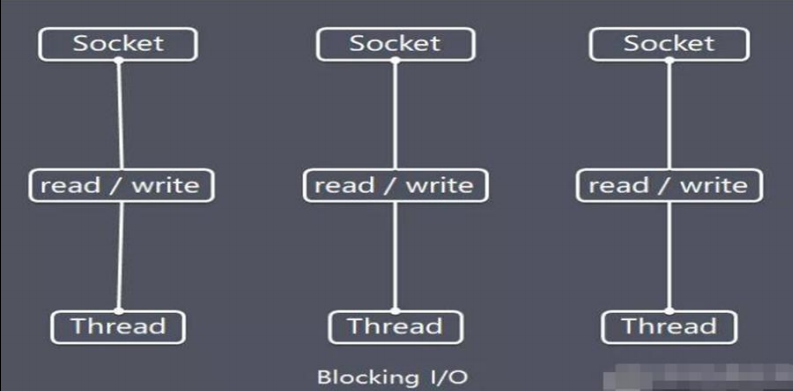

1. 服务器启动一个ServerSocket
2. 客户端启动Socket对服务器进行通信，默认情况下服务器需要对每一个客户建立一个线程与之通信
3. 客户端发出请求吼，先咨询服务器是否有线程响应，如果没有则会等待，或者被拒绝
4. 如果有响应，客户端线程会等待请求结束吼，在继续执行

#### 4.1.3 实例

```java
package com.codeman.netty.bio;

import java.io.InputStream;
import java.net.ServerSocket;
import java.net.Socket;
import java.util.concurrent.ExecutorService;
import java.util.concurrent.Executors;

public class BIOServer {
    public static void main(String[] args) throws Exception {

        //线程池机制

        //思路
        //1. 创建一个线程池
        //2. 如果有客户端连接，就创建一个线程，与之通讯(单独写一个方法)

        ExecutorService newCachedThreadPool = Executors.newCachedThreadPool();

        //创建ServerSocket
        ServerSocket serverSocket = new ServerSocket(6666);

        System.out.println("服务器启动了");

        while (true) {

            System.out.println("线程信息1 id =" + Thread.currentThread().getId() + " 名字=" + Thread.currentThread().getName());
            //监听，等待客户端连接
            System.out.println("等待连接....");
	    // 等待客户端会阻塞
            final Socket socket = serverSocket.accept();
            System.out.println("连接到一个客户端");

            //就创建一个线程，与之通讯(单独写一个方法)
            newCachedThreadPool.execute(new Runnable() {
                public void run() { //我们重写
                    //可以和客户端通讯
                    handler(socket);
                }
            });

        }
  
        // //  客户端1 连接但未输入
        //连接到一个客户端
        //线程信息1 id =1 名字=main
        //等待连接....
        //线程信息2 id =12 名字=pool-1-thread-1
        //线程信息3 id =12 名字=pool-1-thread-1
        //read....
        //
        //// 客户端1 输入
        //zz
        //线程信息3 id =12 名字=pool-1-thread-1
        //read....
        //
        //// 客户端2 连接但未输入
        //连接到一个客户端
        //线程信息1 id =1 名字=main
        //等待连接....
        //线程信息2 id =13 名字=pool-1-thread-2
        //线程信息3 id =13 名字=pool-1-thread-2
        //read....


    }

    //编写一个handler方法，和客户端通讯
    public static void handler(Socket socket) {

        try {
            System.out.println("线程信息2 id =" + Thread.currentThread().getId() + " 名字=" + Thread.currentThread().getName());
            byte[] bytes = new byte[1024];
            //通过socket 获取输入流
            InputStream inputStream = socket.getInputStream();

            //循环的读取客户端发送的数据
            while (true) {

                System.out.println("线程信息3 id =" + Thread.currentThread().getId() + " 名字=" + Thread.currentThread().getName());

                System.out.println("read....");
		// 等待客户端输入会阻塞
               int read =  inputStream.read(bytes);
               if(read != -1) {
                   System.out.println(new String(bytes, 0, read
                   )); //输出客户端发送的数据
               } else {
                   break;
               }
            }


        }catch (Exception e) {
            e.printStackTrace();
        }finally {
            System.out.println("关闭和client的连接");
            try {
                socket.close();
            }catch (Exception e) {
                e.printStackTrace();
            }

        }
    }
}

```

#### 4.1.4 缺陷

1. 每个请求都需要创建独立的线程，与对应的客户端机械能数据Read/业务处理/数据Write
2. 当并发数比较大时，需要创建大量线程来处理连接，系统资源占用较大
3. 连接建立后，如果当前线程暂时没有数据可读，则线程就阻塞在read操作上，会操作线程资源浪费

### 4.2 Java NIO

#### 4.2.1 基本介绍

1. Java NIO全程 java non-blocking IO ，从JDK4开始，是同步非阻塞的
2. NIO三大核心： **通道Channel / 缓冲区Buffer / 选择器Selector**
3. NIO是面向缓冲区，或者说是面向 块 编程的。数据读取到一个它稍后处理的缓冲区，需要时可在缓冲区中前后移动，增加了处理过程的灵活性，使用它可以提供非阻塞式的高伸缩性网络
4. Java NIO的非阻塞模式，使一个线程从某通道发送请求或者读取数据，但它仅能得到目前可用的数据，如果目前没有数据可用，则不会获取，而不是保持线程阻塞，直至数据可读前，都可继续做其他事情。非阻塞写也是如此。
5. NIO可以做到一个线程处理多个操作
6. HTTP2.0使用了多路复用的技术，做到同一个连接并发处理多个请求，而并发请求的数量比HTTP1.1大了好几个数量级

#### 4.2.2 NIO和BIO对比

1. BIO以流的方式处理数据，而NIO以块的方式处理数据，块I/O的效率比流I/O高很多
2. BIO是阻塞的，NIO是非阻塞的
3. BIO是基于字节流和字符流进行操作，而NIO是基于Channel和Buffer进行操作，数据总是从Channel到Buffer，或者从Buffer到Channel。Selector用于监听多个通道的时间(连接请求isAcceptable/数据到达isReadable等)，因此使用单个线程就可以监听多个客户端通道

#### 4.2.3 NIO三大核心

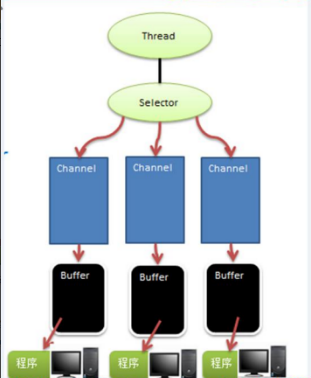

- 每个channel都会对应一个Buffer
- Selector对应一个线程，一个线程对应多个Channel
- 改图反映了有三个channel注册到该selector程序
- 程序切换到哪个channel是由事件决定的，Event就是一个重要的概念
- selector会根据不同的事件，在各个通道上切换
- Buffer就是一个内存块，底层是一个数组
- 数据的读写是通过Buffer。在BIO中要么是输入流/要么是输出流，不能双向。但是NIO的Buffer是可以读也可以写，需要用flip方法切换。channel是双向的，可以返回底层操作系统的情况，比如Linux，底层的操作系统通道就是双向的。

##### 4.2.3.1 缓冲区（Buffer）

###### 4.2.3.1.1 基本介绍

缓冲区（Buffer）：缓冲区本质上是一个可以读写数据的内存块，可以理解成是一个容器对象（含数组），该对象提供了一组方法，可以更轻松地使用内存块，，缓冲区对象内置了一些机制，能够跟踪和记录缓冲区的状态变化情况。Channel 提供从文件、网络读取数据的渠道，但是读取或写入的数据都必须经由 Buffer，如图:【后面举例说明】

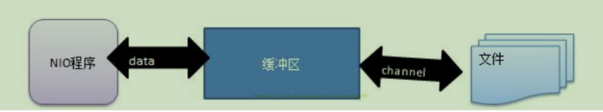

###### 4.2.3.1.2 Buffer主要属性和方法

- 属性

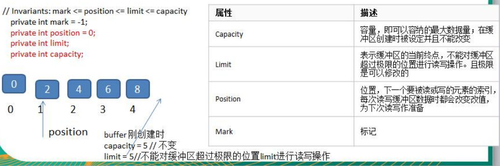

- 方法

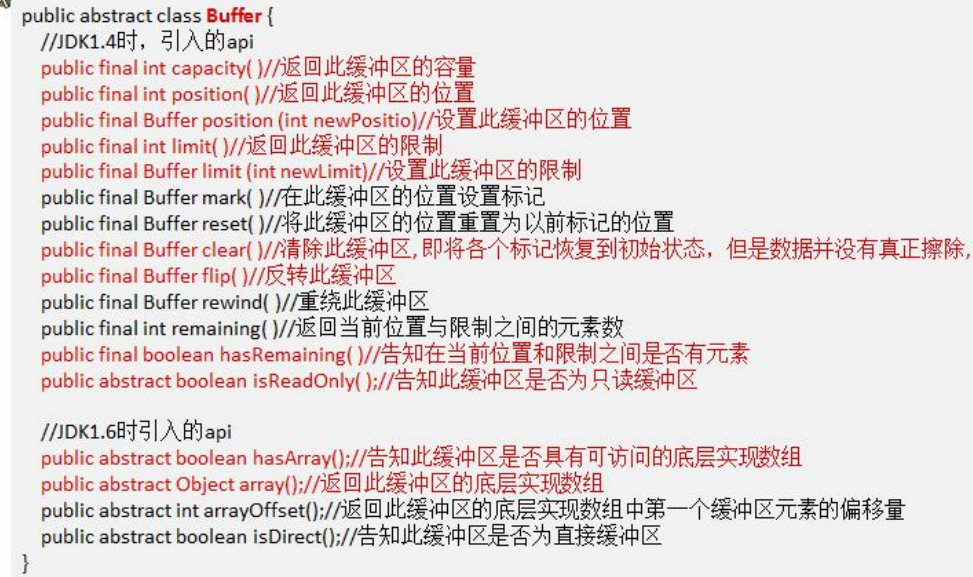

- ByteBuffer主要方法

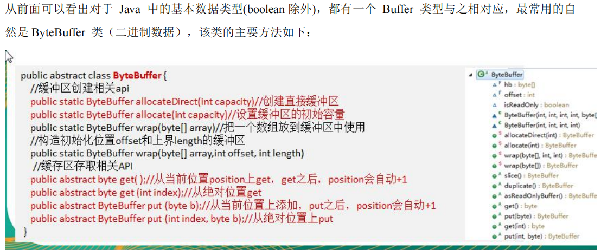

##### 4.2.3.2 通道 (Channel)

###### 4.2.3.2.1 基本介绍

1. NIO 的通道类似于流，但有些区别如下：
   - **通道可以同时进行读写**，而流只能读或者只能写
   - 通道可以实现**异步读写**数据
   - 通道可以从缓冲读数据，也可以写数据到缓冲（**双向**）:
2. BIO 中的 Stream 是单向的，例如 FileInputStream 对象只能进行读取数据的操作，而 NIO 中的通道（Channel）是**双向**的，可以读操作，也可以写操作。
3. Channel 在 NIO 中是一个接口 public interface Channel extends Closeable{}
4. 常用的 Channel 类有：FileChannel、DatagramChannel、ServerSocketChannel 和 SocketChannel。【ServerSocketChanne 类似 ServerSocket、SocketChannel 类似 Socket】
5. FileChannel 用于文件的数据读写，DatagramChannel 用于 UDP 的数据读写，ServerSocketChannel 和 SocketChannel 用于 TCP 的数据读写。

##### 4.2.3.3 选择器 （Selector）

###### 4.2.3.3.1 基本介绍

1. Java 的 NIO，用非阻塞的 IO 方式。可以用一个线程，处理多个的客户端连接，就会使用到 Selector（选择器）。
2. Selector 能够检测多个注册的通道上是否有事件发生（注意：多个 Channel 以事件的方式可以注册到同一个 Selector），如果有事件发生，便获取事件然后针对每个事件进行相应的处理。这样就可以只用一个单线程去管理多个通道，也就是管理多个连接和请求。
3. 只有在连接/通道真正有读写事件发生时，才会进行读写，就大大地减少了系统开销，并且不必为每个连接都创建一个线程，不用去维护多个线程。
4. 避免了多线程之间的上下文切换导致的开销。

###### 4.2.3.3.2 Selector示意图

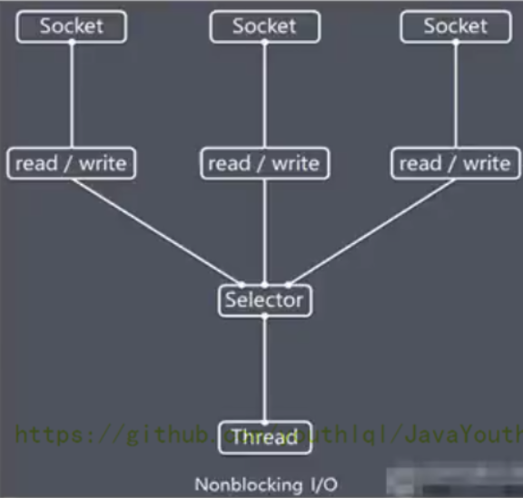

1. Netty 的 IO 线程 NioEventLoop 聚合了 Selector（选择器，也叫多路复用器），可以同时并发处理成百上千个客户端连接。
2. 当线程从某客户端 Socket 通道进行读写数据时，若没有数据可用时，该线程可以进行其他任务。
3. 线程通常将非阻塞 IO 的空闲时间用于在其他通道上执行 IO 操作，所以单独的线程可以管理多个输入和输出通道。
4. 由于读写操作都是非阻塞的，这就可以充分提升 IO 线程的运行效率，避免由于频繁 I/O 阻塞导致的线程挂起。
5. 一个 I/O 线程可以并发处理 N 个客户端连接和读写操作，这从根本上解决了传统同步阻塞 I/O 一连接一线程模型，架构的性能、弹性伸缩能力和可靠性都得到了极大的提升。

###### 4.2.3.3.3 主要方法

* `Selector.open();`  // 获取一个Selector对象
* `selector.keys();` // 所有SelectionKeyke
* `selector.selectedKeys();` // 有事件的所有SelectionKeyke
* `selector.select();` //阻塞
* `selector.select(1000);` //阻塞 1000 毫秒，在 1000 毫秒后返回
* `selector.wakeup();` //唤醒 selector
* `selector.selectNow();` //不阻塞，立马返还

###### 4.2.3.3.3 NIO非阻塞网络编程原理

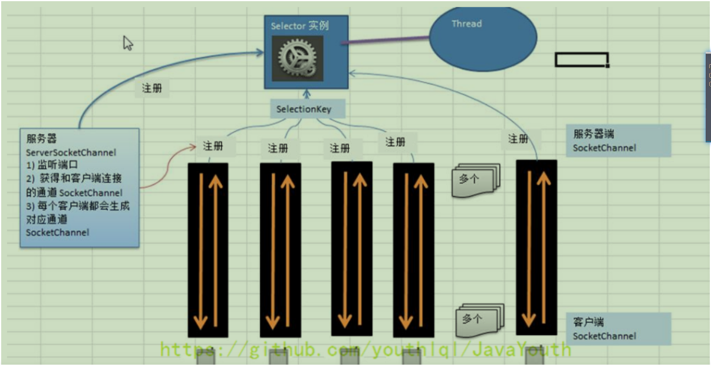

1. 当客户端连接时，会通过 ServerSocketChannel 得到 SocketChannel。
2. Selector 进行监听 select 方法，返回有事件发生的通道的个数。
3. 将 socketChannel 注册到 Selector 上，register(Selector sel, int ops)，一个 Selector 上可以注册多个 SocketChannel。
4. 注册后返回一个 SelectionKey，会和该 Selector 关联（集合）。
5. 进一步得到各个 SelectionKey（有事件发生）。
6. 在通过 SelectionKey 反向获取 SocketChannel，方法 channel()。
7. 可以通过得到的 channel，完成业务处理。

#### 4.2.4 SelectionKey

1. SelectionKey，表示 Selector 和网络通道的注册关系，共四种：

- int OP_ACCEPT：有新的网络连接可以 accept，值为 16
- int OP_CONNECT：代表连接已经建立，值为 8
- int OP_READ：代表读操作，值为 1
- int OP_WRITE：代表写操作，值为 4

2. 主要方法

- Selector  selector() // 得到关联的Selector对象
- SelectableChannel cannel() // 得到关联的通道
- Object attachment() // 得到关联的共享数据
- SelectionKey interestOps(int ops) // 设置或改变监听事件
- boolean isAcceptable() // 是否有连接请求
- boolean isReadable() // 是否有读操作
- boolean isWritable() // 是否有写操作

#### 4.2.5 ServerSocketChannel

1. `ServerSocketChannel` 在服务器端监听新的客户端 `Socket` 连接，负责监听，不负责实际的读写操作
2. 主要方法：

- ServerSocketChannel open() // 得到一个SSC通道
- ServerSocketChannel bind(SocketAddress local) // 设置监控的地址
- SelectableChannel configureBlocking(boolean block) // 设置是否阻塞， 默认true为阻塞
- SelectionKey register(Selector sel, int ops) // 注册到一个选择器上并设置监听事件

#### 4.2.6 SocketChannel

1. `SocketChannel`，网络 `IO` 通道， **具体负责进行读写操作** 。`NIO` 把缓冲区的数据写入通道，或者把通道里的数据读到缓冲区。
2. 主要方法：

- SocketChannel open() // 得到一个SocketChannel通道
- SelectableChannel configureBlocking(boolean block) // 设置是否阻塞， 默认true为阻塞
- boolean connect(SocketAddress remote) // 连接服务器
- boolean finishConnect() // 如果connect()连接失败，则通过这个方法完成连接
- int write(ByteBuffer src) // 往通道写数据
- in read(ByteBuffer src) // 从通道读数据
- SelectionKey register(Selector sel, int ops, Object att) // 注册一个选择器并设置监听事件，最后一个参数可以设置共享数据
- void close() // 关闭通道

#### 4.2.7 实例：多人聊天室

- Server

```java
package com.codeman.netty.nio;

import java.net.InetSocketAddress;
import java.nio.ByteBuffer;
import java.nio.channels.Channel;
import java.nio.channels.SelectableChannel;
import java.nio.channels.SelectionKey;
import java.nio.channels.Selector;
import java.nio.channels.ServerSocketChannel;
import java.nio.channels.SocketChannel;
import java.util.Iterator;

/**
 * @author: zhanghongjie
 * @description:
 * @date: 2022/6/24 22:36
 * @version: 1.0
 */
public class SocketServer {
    private final static String HOST = "127.0.0.1";
    private final static int PORT = 6677;
    private static ServerSocketChannel serverSocketChannel;
    private static Selector selector;

    public static void main(String[] args) throws Exception {
        //得到选择器
        selector = Selector.open();
        serverSocketChannel = ServerSocketChannel.open();
        serverSocketChannel.socket().bind(new InetSocketAddress(HOST, PORT));
        // 非阻塞
        serverSocketChannel.configureBlocking(false);
        // 注册
        serverSocketChannel.register(selector, SelectionKey.OP_ACCEPT);

        // 有连接通道
        while (true) {
            if (selector.select(2000) > 0) {
                Iterator<SelectionKey> selectionKeyIterator = selector.selectedKeys().iterator();

                while (selectionKeyIterator.hasNext()) {
                    SelectionKey selectionKey = selectionKeyIterator.next();
                    if (selectionKey.isAcceptable()) {
                        // 建立连接
                        ServerSocketChannel serverSocketChannel = (ServerSocketChannel) selectionKey.channel();
                        SocketChannel channel = serverSocketChannel.accept();
                        // 非阻塞
                        channel.configureBlocking(false);
                        // 注册
                        channel.register(selector, SelectionKey.OP_READ);
                        System.out.println(channel.getRemoteAddress() + " 注册了...");
                    }
                    // 可读
                    if (selectionKey.isReadable()) {
                        // 选择到的通道
                        ByteBuffer byteBuffer = ByteBuffer.allocate(1024);
                        SocketChannel channel = (SocketChannel) selectionKey.channel();
                        if (channel.read(byteBuffer) > 0) {
                            String msg = new String(byteBuffer.array());
                            System.out.println("读取信息：" + msg);
                            // 服务器向客户广播递信息
                            Iterator<SelectionKey> iterator = selector.keys().iterator();
                            while (iterator.hasNext()) {
                                Channel channel1 = iterator.next().channel();
                                if (channel1 instanceof SocketChannel && channel1 != channel) {
                                    // 排除服务器
                                    ByteBuffer byteBuffer1 = ByteBuffer.wrap(msg.getBytes());
                                    ((SocketChannel)channel1).write(byteBuffer1);
                                }
                            }
                        }
                    }


                    // 移除key，避免重复读取
                    selectionKeyIterator.remove();
                }
            }
        }
    }
}

```

- Client

```java
package com.codeman.netty.nio;

import java.io.IOException;
import java.net.InetSocketAddress;
import java.nio.ByteBuffer;
import java.nio.channels.SelectionKey;
import java.nio.channels.Selector;
import java.nio.channels.ServerSocketChannel;
import java.nio.channels.SocketChannel;
import java.util.Iterator;
import java.util.Scanner;

/**
 * @author: zhanghongjie
 * @description:
 * @date: 2022/6/24 22:44
 * @version: 1.0
 */
public class SocketClient {
    private final static String HOST = "127.0.0.1";
    private final static int PORT = 6677;
    private static SocketChannel socketChannel;
    private static Selector selector;

    public static void main(String[] args) throws Exception {
        selector = Selector.open();
        socketChannel = SocketChannel.open(new InetSocketAddress(HOST, PORT));
        socketChannel.configureBlocking(false);
        socketChannel.register(selector, SelectionKey.OP_READ);

        // 监听channel
        new Thread(() -> {
            while (true) {
                try {
                    // 重要，查找通道，否则selector.selectedKeys()没东西
                    if (selector.select() > 0) {//有可以用的通道

                        Iterator<SelectionKey> iterator = selector.selectedKeys().iterator();
                        while (iterator.hasNext()) {
                            SelectionKey selectionKey = iterator.next();
                            if (selectionKey.isReadable()) {
                                ByteBuffer byteBuffer = ByteBuffer.allocate(1024);
                                SocketChannel channel = (SocketChannel) selectionKey.channel();
                                System.out.println(channel.read(byteBuffer));
                                String msg = new String(byteBuffer.array());
                                System.out.println("读取信息：" + msg);
                            }
                            // 重要！
                            iterator.remove();
                        }
                    }
                } catch (IOException e) {
                    e.printStackTrace();
                }

            }

        }).start();


        // 监听输入
        Scanner scanner = new Scanner(System.in);
        while (scanner.hasNextLine()) {
            String msg = scanner.nextLine();
            // 发送给服务器，服务器再广播
            socketChannel.write(ByteBuffer.wrap(msg.getBytes()));
        }
    }
}

```

### 4.3 NIO与零拷贝

#### 4.3.1 基本介绍

1. 零拷贝是网络编程的关键，很多性能优化都离不开。
2. 在 `Java` 程序中，常用的零拷贝有 `mmap`（内存映射）和 `sendFile`。那么，他们在 `OS` 里，到底是怎么样的一个的设计？我们分析 `mmap` 和 `sendFile` 这两个零拷贝

#### 4.3.2 传统 IO 模型

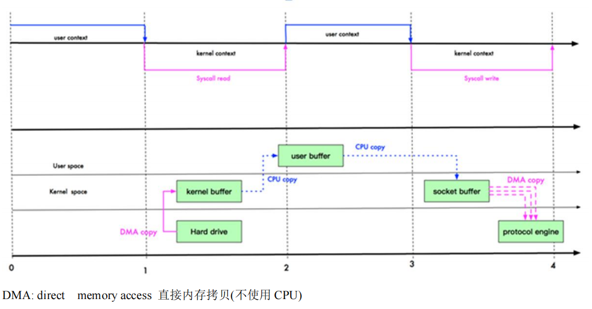

**DMA** ：`direct memory access` 直接内存拷贝（不使用 `CPU`）

#### 4.3.3 mmap内存映射优化

1. `mmap` 通过**内存映射**，将文件映射到内核缓冲区，同时，用户空间可以共享内核空间的数据。这样，在进行网络传输时，就可以减少内核空间到用户空间的拷贝次数。如下图

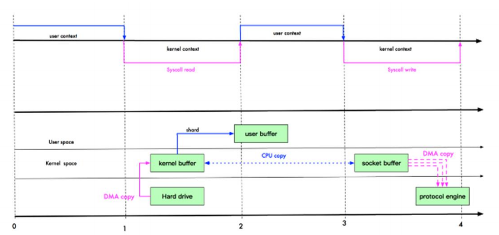

#### 4.3.4 sendFile优化

1. `Linux2.1` 版本提供了 `sendFile` 函数，其基本原理如下：数据根本**不经过用户态**，直接从内核缓冲区进入到 `SocketBuffer`，同时，由于和用户态完全无关，就减少了一次上下文切换

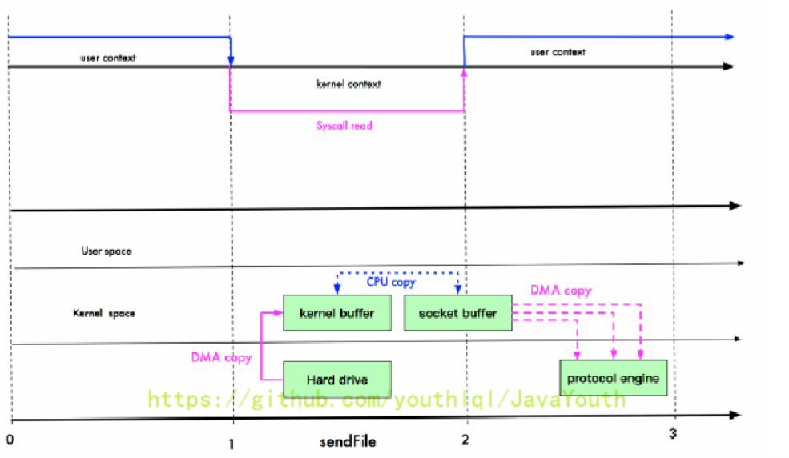

2. 零拷贝从操作系统角度，**是没有 `cpu` 拷贝**
3. `Linux在2.4` 版本中，做了一些修改，避免了从内核缓冲区拷贝到 `Socketbuffer` 的操作，直接拷贝到协议栈，从而再一次减少了数据拷贝。具体如下图和小结：

这里其实只有一个cpu拷贝，但是拷贝的信息比较少，就是一些desc描述信息，比如length/offset等，消耗低，可忽略

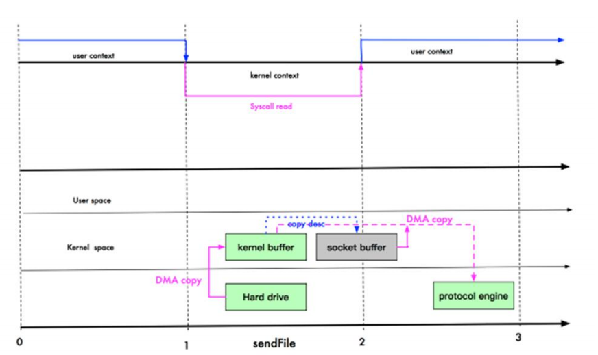

#### 4.3.5 零拷贝的再次理解

1. mmap 适合小数据量读写，sendFile 适合大文件传输。
2. mmap 需要 4 次上下文切换，3 次数据拷贝；sendFile 需要 3 次上下文切换，最少 2 次数据拷贝。
3. sendFile 可以利用 DMA 方式，减少 CPU 拷贝，mmap 则不能（必须从内核拷贝到 Socket缓冲区）。

### 4.4. Java AIO

#### 4.4.1 基本介绍

1. JDK7 引入了 AsynchronousI/O，即 AIO。在进行 I/O 编程中，常用到两种模式：Reactor 和 Proactor。Java 的 NIO 就是 Reactor，当有事件触发时，服务器端得到通知，进行相应的处理
2. AIO 即 NIO2.0，叫做**异步不阻塞**的 IO。AIO 引入异步通道的概念，采用了 Proactor 模式，简化了程序编写，有效的请求才启动线程，它的特点是先由操作系统完成后才通知服务端程序启动线程去处理，一般适用于连接数较多且连接时间较长的应用
3. 目前 AIO 还没有广泛应用，Netty 也是基于 NIO，而不是 AIO，因此我们就不详解 AIO 了，有兴趣的同学可以参考《Java新一代网络编程模型AIO原理及Linux系统AIO介绍》http://www.52im.net/thread-306-1-1.html

#### 4.4.2 BIO、NIO、AIO 对比表

|          |   BIO   |          NIO          |    AIO    |
| :------: | :------: | :--------------------: | :--------: |
|  IO模型  | 同步阻塞 | 同步非阻塞（多路复用） | 异步非阻塞 |
| 编程难度 |   简单   |          复杂          |    复杂    |
|  可靠性  |    差    |           好           |     好     |
|  吞吐量  |    低    |           高           |     高     |

1. 同步阻塞：到理发店理发，就一直等理发师，直到轮到自己理发。
2. 同步非阻塞：到理发店理发，发现前面有其它人理发，给理发师说下，先干其他事情，一会过来看是否轮到自己.
3. 异步非阻塞：给理发师打电话，让理发师上门服务，自己干其它事情，理发师自己来家给你理发

## 5. Netty概述

### 5.1 原生NIO存在的问题

1. NIO 的类库和 API 繁杂，使用麻烦：需要熟练掌握 Selector、ServerSocketChannel、SocketChannel、ByteBuffer等。
2. 需要具备其他的额外技能：要熟悉 Java 多线程编程，因为 NIO 编程涉及到 Reactor 模式，你必须对多线程和网络编程非常熟悉，才能编写出高质量的 NIO 程序。
3. 开发工作量和难度都非常大：例如客户端面**临断连重连、网络闪断、半包读写、失败缓存、网络拥塞和异常流的处理**等等。
4. JDK NIO 的 Bug：例如臭名昭著的 Epoll Bug，它会导致 Selector 空轮询，最终导致 CPU100%。直到 JDK1.7 版本该问题仍旧存在，没有被根本解决。

### 5.2 Netty的优点

*Netty 对 JDK 自带的 NIO 的 API 进行了封装，解决了上述NIO问题。*

1. 设计优雅：适用于各种传输类型的统一 API 阻塞和非阻塞 Socket；基于灵活且可扩展的事件模型，可以清晰地分离关注点；高度可定制的线程模型-单线程，一个或多个线程池。
2. 使用方便：详细记录的 Javadoc，用户指南和示例；没有其他依赖项，JDK5（Netty3.x）或 6（Netty4.x）就足够了。
3. **高性能、吞吐量更高：延迟更低；减少资源消耗；最小化不必要的内存复制**。
4. 安全：完整的 SSL/TLS 和 StartTLS 支持。
5. 社区活跃、不断更新：社区活跃，版本迭代周期短，发现的 Bug 可以被及时修复，同时，更多的新功能会被加入。

### 5.3 Netty版本

1. Netty 版本分为 Netty 3.x 和 Netty 4.x、Netty 5.x
   因为 Netty 5 出现重大 bug，已经被官网废弃了，目前推荐使用的是 Netty 4.x的稳定版本
2. 目前在官网可下载的版本 Netty 3.x、Netty 4.0.x 和 Netty 4.1.x

## 6. Netty高性能框架设计

### 6.1 线程模型

不同的线程模式，对程序的性能有很大影响。目前存在的线程模型有：传统阻塞 I/O 服务模型 和Reactor 模式。
根据 Reactor 的数量和处理资源池线程的数量不同，有 3 种典型的实现

1. 单 Reactor 单线程；
2. 单 Reactor多线程；
3. 主从 Reactor多线程

Netty 线程模式（Netty 主要基于主从 Reactor 多线程模型做了一定的改进，其中主从 Reactor 多线程模型有多个 Reactor）

### 6.2传统阻塞 I/O 服务模型

1. 工作原理图

* 黄色的框表示对象，蓝色的框表示线程
* 白色的框表示方法（`API`）

  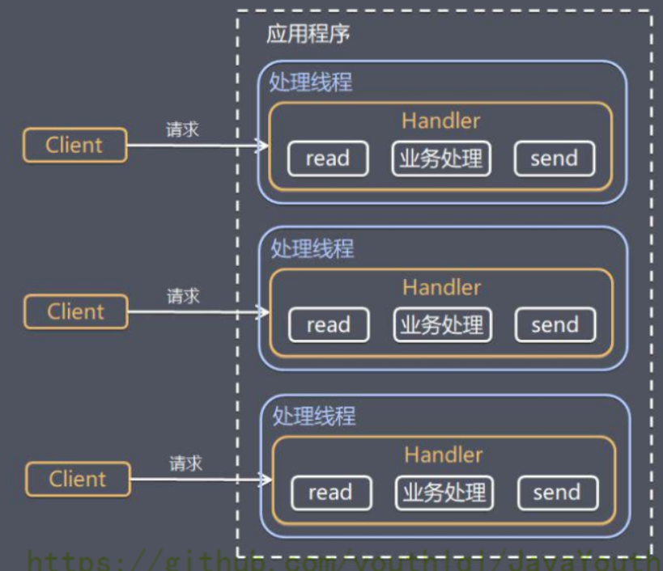

2. 模型特点

* 采用阻塞 `IO` 模式获取输入的数据
* **每个连接都需要独立的线程**完成数据的输入，业务处理，数据返回

3. 问题分析

* 当并发数很大，就会创建**大量的线程**，占用很大**系统资源**
* 连接创建后，如果当前线程暂时没有数据可读，该线程会**阻塞在 Handler对象中的 `read` 操作，导致上面的处理线程资源浪费**

### 6.3 Reactor 模式

#### 6.3.1 针对传统阻塞 I/O 服务模型的 2 个缺点，解决方案：

1. 基于 I/O 复用模型：**多个连接共用一个阻塞对象ServiceHandler**，应用程序只需要在一个阻塞对象等待，无需阻塞等待所有连接。当某个连接有新的数据可以处理时，操作系统通知应用程序，线程从阻塞状态返回，开始进行业务处理。

   Reactor 在不同书中的叫法：

   反应器模式

   分发者模式（Dispatcher）

   通知者模式（notifier）
2. 基于线程池复用线程资源：不必再为每个连接创建线程，将连接完成后的业务处理任务分配给线程进行处理，一个线程可以处理多个连接的业务。（解决了当并发数很大时，会创建大量线程，占用很大系统资源）
3. 基于 I/O 复用模型：多个客户端进行连接，先把连接请求给ServiceHandler。多个连接共用一个阻塞对象ServiceHandler。假设，当C1连接没有数据要处理时，C1客户端只需要阻塞于ServiceHandler，C1之前的处理线程便可以处理其他有数据的连接，不会造成线程资源的浪费。当C1连接再次有数据时，ServiceHandler根据线程池的空闲状态，将请求分发给空闲的线程来处理C1连接的任务。（解决了线程资源浪费的那个问题）

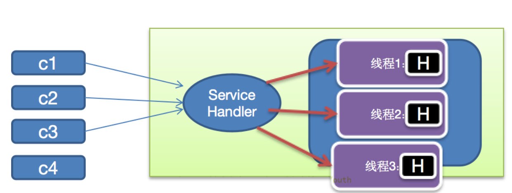

#### 6.3.2 I/O 复用结合线程池，就是 Reactor 模式基本设计思想

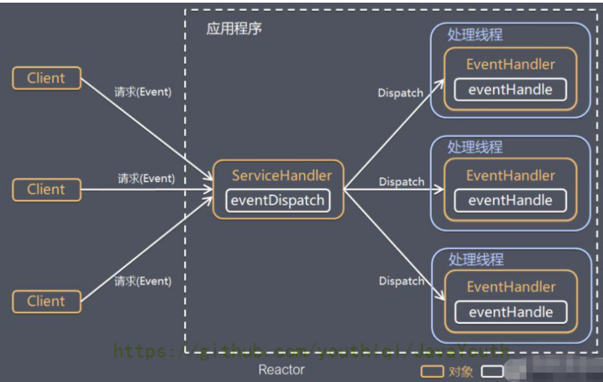

1. Reactor 模式，通过一个或多个输入同时传递给服务处理器（ServiceHandler）的模式（基于事件驱动）
2. 服务器端程序处理传入的多个请求,并将它们**同步分派**到相应的处理线程，因此 Reactor 模式也叫 Dispatcher 模式
3. Reactor 模式使用 **IO 复用监听事件**，收到事件后，分发给某个线程（进程），这点就是网络服务器高并发处理关键

#### 6.3.3 Reactor 模式中核心组成

1. Reactor（也就是那个ServiceHandler）：Reactor 在一个**单独的线程**中运行，**负责监听和分发事件**，分发给适当的处理线程来对 IO 事件做出反应。它就像公司的电话接线员，它接听来自客户的电话并将线路转移到适当的联系人；
2. Handlers（处理线程EventHandler）：处理线程**执行 I/O 事件要完成的实际事件**，类似于客户想要与之交谈的公司中的实际官员。Reactor 通过调度适当的处理线程来响应 I/O 事件，处理程序执行非阻塞操作。

#### 6.3.4 Reactor 模式分类

根据 `Reactor` 的数量和处理资源池线程的数量不同，有 `3` 种典型的实现

1. 单 `Reactor` 单线程
2. 单 `Reactor` 多线程
3. 主从 `Reactor` 多线程

**三种模式用生活案例来理解**

1. 单 `Reactor` 单线程，前台接待员和服务员是同一个人，全程为顾客服
2. 单 `Reactor` 多线程，`1` 个前台接待员，多个服务员，接待员只负责接待
3. 主从 `Reactor` 多线程，多个前台接待员，多个服务生

**Reactor 模式具有如下的优点**

1. 响应快，不必为单个同步时间所阻塞，虽然 Reactor 本身依然是同步的（比如你第一个SubReactor阻塞了，我可以调下一个 SubReactor为客户端服务）
2. 可以最大程度的避免复杂的多线程及同步问题，并且避免了多线程/进程的切换开销
3. 扩展性好，可以方便的通过增加 Reactor 实例个数来充分利用 CPU 资源
4. 复用性好，Reactor 模型本身与具体事件处理逻辑无关，具有很高的复用性

### 6.4 单 Reactor 单线程

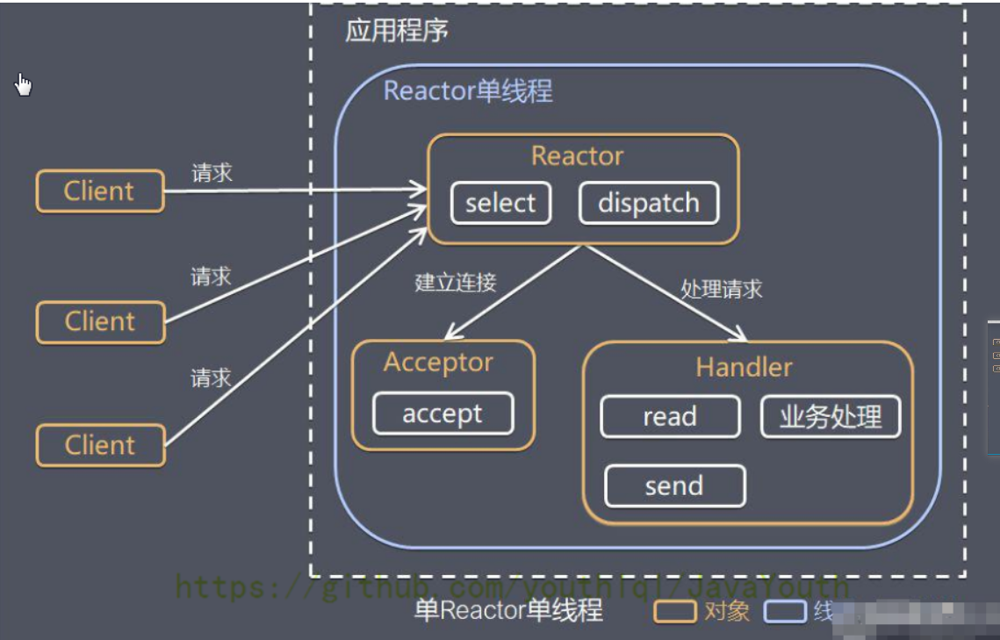

**1. 方案说明**

- Select 是前面 I/O 复用模型介绍的标准网络编程 API，可以实现应用程序通过一个阻塞对象监听多路连接请求
- Reactor 对象通过 Select 监控客户端请求事件，收到事件后通过 Dispatch 进行分发
- 如果是建立连接请求事件，则由 Acceptor 通过 Accept 处理连接请求，然后创建一个 Handler 对象处理连接完成后的后续业务处理
- 如果不是建立连接事件，则 Reactor 会分发调用连接对应的 Handler 来响应
  Handler 会完成 Read → 业务处理 → Send 的完整业务流程

结合实例：服务器端用一个线程通过多路复用搞定所有的 `IO` 操作（包括连接，读、写等），编码简单，清晰明了，但是如果客户端连接数量较多，将无法支撑，前面的 `NIO` 案例就属于这种模型。

**2. 方案优缺点分析**

- 优点：模**型简单**，没有多线程、进程通信、竞争的问题，全部都在一个线程中完成
- 缺点：**性能问题**，只有一个线程，无法完全发挥多核 CPU 的性能。Handler在处理某个连接上的业务时，整个进程无法处理其他连接事件，很容易导致性能瓶颈
- 缺点：可靠性问题，线程意外终止，或者进入死循环，会导致整个系统通信模块不可用，不能接收和处理外部消息，造成节点故障
- 使用场景：**客户端的数量有限，业务处理非常快速**，比如 Redis 在业务处理的时间复杂度 O(1) 的情况

### 6.5 单Reactor多线程

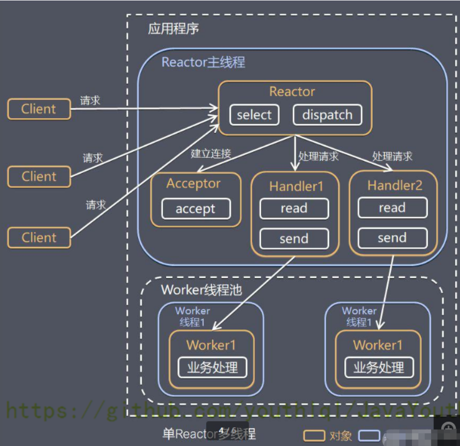

**1. 方案说明**

- Reactor 对象通过 Select 监控客户端请求事件，收到事件后，通过 Dispatch 进行分发
- 如果是建立连接请求，则由 Acceptor 通过 accept 处理连接请求，然后创建一个 Handler 对象处理完成连接后的各种事件
- 如果不是连接请求，则由 Reactor 分发调用连接对应的 handler 来处理（也就是说连接已经建立，后续客户端再来请求，那基本就是数据请求了，直接调用之前为这个连接创建好的handler来处理）
- handler 只负责响应事件，不做具体的业务处理（这样不会使handler阻塞太久），通过 read 读取数据后，会分发给后面的 worker 线程池的某个线程处理业务。**【业务处理是最费时的，所以将业务处理交给线程池去执行】**
- worker 线程池会分配独立线程完成真正的业务，并将结果返回给 handler
- handler 收到响应后，通过 send 将结果返回给 client

**2.方案优缺点**

* 优点：可以充分的利用多核 `cpu` 的处理能力
* 缺点：多线程数据共享和访问比较复杂。`Reactor` 承担所有的事件的监听和响应，它是单线程运行，在高并发场景容易出现性能瓶颈。也就是说 **`Reactor`主线程承担了过多的事**

### 6.6 主从 Reactor 多线程

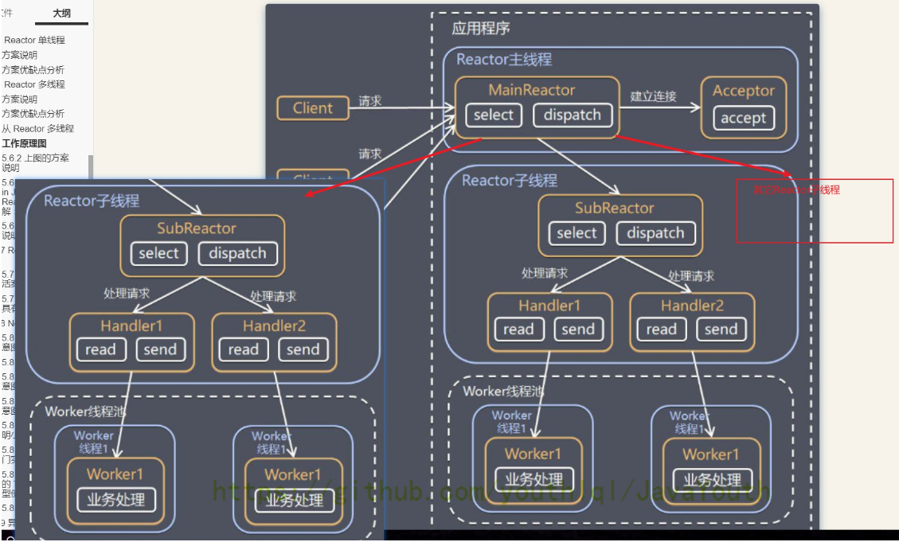

**1.工作原理**

- Reactor 主线程 MainReactor 对象通过 select 监听连接事件，收到事件后，通过 Acceptor 处理连接事件
- 当 Acceptor 处理连接事件后，**MainReactor 将连接分配给 SubReactor**
- subreactor 将连接加入到连接队列进行监听，并创建 handler 进行各种事件处理
- 当有新事件发生时，subreactor 就会调用对应的 handler 处理
- handler 通过 read 读取数据，分发给后面的 **worker 线程**处理
- worker 线程池分配独立的 worker 线程进行业务处理，并返回结果
- handler 收到响应的结果后，再通过 send 将结果返回给 client
- **Reactor 主线程可以对应多个 Reactor 子线程，即 MainRecator 可以关联多个 SubReactor**

**2.优缺点**

- 优点：父线程与子线程的数据交互简单职责明确，**父线程只需要接收新连接**，**子线程完成后续的业务处理**。
- 优点：父线程与子线程的数据交互简单，**`Reactor` 主线程只需要把新连接传给子线程，子线程无需返回数据**。
- 缺点：编程复杂度较高

结合实例：这种模型在许多项目中广泛使用，**包括 `Nginx` 主从 `Reactor` 多进程模型，`Memcached` 主从多线程，`Netty` 主从多线程模型的支持**

## 7. Netty模型

### 7.1 工作原理示意图1 - 简单版

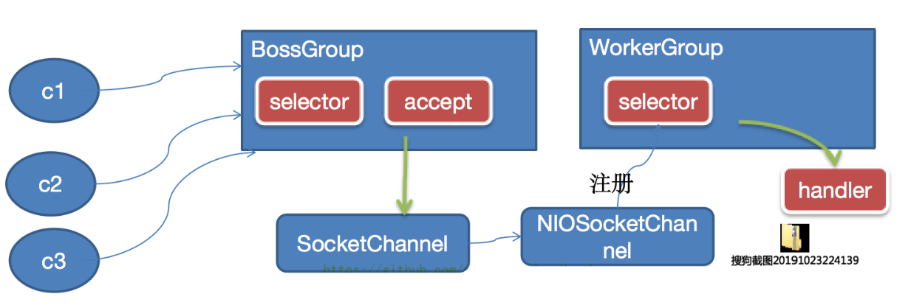

`Netty` 主要基于主从 `Reactors` 多线程模型（如图）做了一定的改进，其中主从 `Reactor` 多线程模型有多个 `Reactor`

1. BossGroup 线程维护 Selector，**只关注 Accecpt**
2. 当接收到 Accept 事件，获取到对应的 SocketChannel，封装成 NIOScoketChannel 并注册到 Worker 线程（事件循环），并进行维护
3. 当 Worker 线程监听到 Selector 中通道发生自己感兴趣的事件后，就进行处理（就由 handler），注意 handler 已经加入到通道

### 7.2 工作原理示意图2 - 进阶版

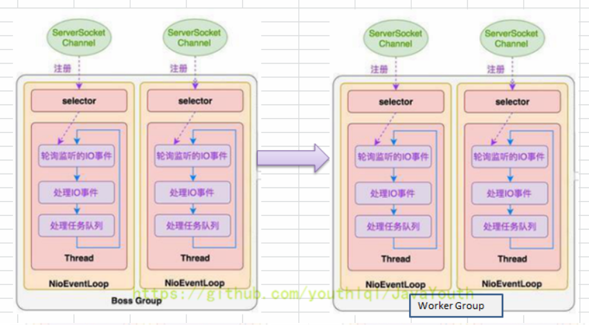

`BossGroup`有点像主 `Reactor` 可以有多个，`WorkerGroup`则像 `SubReactor`一样可以有多个。

### 7.3 工作原理示意图3 - 详细版

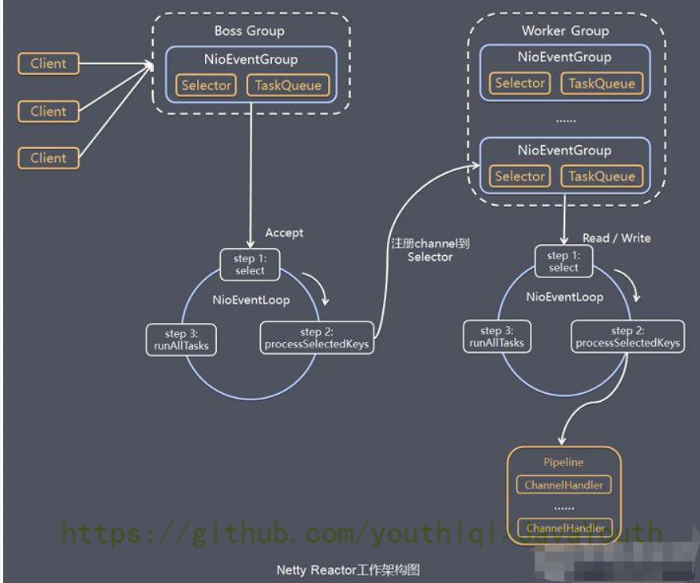

1. Netty 抽象出两组线程池 ，**BossGroup 专门负责接收客户端的连接，WorkerGroup 专门负责网络的读写**
2. BossGroup 和 WorkerGroup 类型都是 NioEventLoopGroup
3. NioEventLoopGroup 相当于一个事件循环组，这个组中含有多个事件循环，每一个事件循环是 NioEventLoop
4. NioEventLoop 表示一个不断循环的执行处理任务的线程，**每个 NioEventLoop 都有一个 Selector，用于监听绑定在其上的 socket 的网络通讯**
5. NioEventLoopGroup 可以有多个线程，即可以含有多个 NioEventLoop
6. 每个 BossGroup下面的NioEventLoop 循环执行的步骤有 3 步
   - 轮询 accept 事件
   - **处理 accept 事件**，与 client 建立连接，生成 NioScocketChannel，并将其注册到某个 workerGroup NIOEventLoop 上的 Selector
   - 继续处理任务队列的任务，即 runAllTasks
7. 每个 WorkerGroup NIOEventLoop 循环执行的步骤
   - 轮询 read，write 事件
   - **处理 I/O 事件，即 read，write 事件**，在对应 NioScocketChannel 处理
   - 处理任务队列的任务，即 runAllTasks
8. 每个 Worker NIOEventLoop 处理业务时，会使用 pipeline（管道），pipeline 中包含了 channel（通道），即通过 pipeline 可以获取到对应通道，管道中维护了很多的处理器。（这个点目前只是简单的讲，后面重点说）

### 7.4 Netty快速入门

- NettyServer

  ```java
  package com.codeman.netty.netty.simple;

  import io.netty.bootstrap.ServerBootstrap;
  import io.netty.channel.ChannelFuture;
  import io.netty.channel.ChannelInitializer;
  import io.netty.channel.ChannelOption;
  import io.netty.channel.EventLoopGroup;
  import io.netty.channel.nio.NioEventLoopGroup;
  import io.netty.channel.socket.SocketChannel;
  import io.netty.channel.socket.nio.NioServerSocketChannel;
  import io.netty.util.concurrent.GenericFutureListener;

  import java.net.InetSocketAddress;

  /**
   * @author: zhanghongjie
   * @description:
   * @date: 2022/7/10 11:17
   * @version: 1.0
   */
  public class SimpleNettyServer {

      public static void main(String[] args) {
          //1. 创建两个线程组 bossGroup 和 workerGroup
          //2. bossGroup 只是处理连接请求 , 真正的和客户端业务处理，会交给 workerGroup完成
          //3. 两个都是无限循环
          //4. bossGroup 和 workerGroup 含有的子线程(NioEventLoop)的个数
          //   默认实际 cpu核数 * 2 SystemPropertyUtil.getInt("io.netty.eventLoopThreads", NettyRuntime.availableProcessors() * 2)
          EventLoopGroup bossGroup = new NioEventLoopGroup(1);
          EventLoopGroup workGroup = new NioEventLoopGroup();

          try {
              //创建服务器端的启动对象，配置参数
              ServerBootstrap bootstrap = new ServerBootstrap();
              bootstrap.group(bossGroup, workGroup) //设置两个线程组
                      .channel(NioServerSocketChannel.class) // 使用NioServerSocketChannel 作为服务器的通道实现
                      .option(ChannelOption.SO_BACKLOG, 128) // 设置线程队列得到连接个数
                      .childOption(ChannelOption.SO_KEEPALIVE, true) //设置保持活动连接状态
                      .childHandler(new ChannelInitializer<SocketChannel>(){
                          //给pipeline 设置处理器
                          @Override
                          protected void initChannel(SocketChannel ch) throws Exception {
                              ch.pipeline().addLast(new CusServerChannleHandler());
                          }
                      });

              System.out.println(".....服务器 is ready...");

              //绑定一个端口并且同步, 生成了一个 ChannelFuture 对象
              //启动服务器(并绑定端口)
              ChannelFuture channelFuture = bootstrap.bind(new InetSocketAddress("localhost", 6677));
              System.out.println("future " + channelFuture);

              //给cf 注册监听器，监控我们关心的事件
              channelFuture.addListener((GenericFutureListener) future -> {
                  System.out.println("future inner " + future); // 和外面是同一个
                  if (future.isSuccess()) {
                      System.out.println("监听端口 6668 成功");
                  } else {
                      System.out.println("监听端口 6668 失败");
                  }
              });
              //给关闭通道进行监听
              channelFuture.channel().closeFuture().sync();

          } catch (InterruptedException e) {
              e.printStackTrace();
          } finally {
              bossGroup.shutdownGracefully();
              workGroup.shutdownGracefully();
          }
      }
  }

  ```
- NettyServerHandler

  ```java
  package com.codeman.netty.netty.simple;

  import io.netty.buffer.ByteBuf;
  import io.netty.buffer.Unpooled;
  import io.netty.channel.Channel;
  import io.netty.channel.ChannelHandlerContext;
  import io.netty.channel.ChannelInboundHandlerAdapter;
  import io.netty.channel.ChannelPipeline;
  import io.netty.util.CharsetUtil;

  /**
   * @author: zhanghongjie
   * @description:
   * @date: 2022/7/10 11:31
   * @version: 1.0
   */
  public class CusServerChannleHandler extends ChannelInboundHandlerAdapter {

      @Override
      public void channelActive(ChannelHandlerContext ctx) throws Exception {
          System.out.println("CusServerChannleHandler  ==  channelActive");
  //        super.channelActive(ctx);
      }

      @Override
      public void channelRead(ChannelHandlerContext ctx, Object msg) throws Exception {
          ByteBuf byteBuf = (ByteBuf) msg;
          System.out.println("CusServerChannleHandler  ==  channelRead， msg=" + byteBuf.toString(CharsetUtil.UTF_8));
          Channel channel = ctx.channel();
          ChannelPipeline pipeline = ctx.pipeline(); //本质是一个双向链接, 出站入站
          System.out.println("客户端地址:" + channel.remoteAddress());


  	// 比如这里我们有一个非常耗时长的业务-> 异步执行 -> 提交该channel 对应的
          // NIOEventLoop 的 taskQueue中,

          // 解决方案1 用户程序自定义的普通任务

          ctx.channel().eventLoop().execute(new Runnable() {
              @Override
              public void run() {

                  try {
                      Thread.sleep(5 * 1000);
                      ctx.writeAndFlush(Unpooled.copiedBuffer("hello, 客户端~(>^ω^<)喵2", CharsetUtil.UTF_8));
                      System.out.println("channel code=" + ctx.channel().hashCode());
                  } catch (Exception ex) {
                      System.out.println("发生异常" + ex.getMessage());
                  }
              }
          });

          ctx.channel().eventLoop().execute(new Runnable() {
              @Override
              public void run() {

                  try {
                      Thread.sleep(5 * 1000);
                      ctx.writeAndFlush(Unpooled.copiedBuffer("hello, 客户端~(>^ω^<)喵3", CharsetUtil.UTF_8));
                      System.out.println("channel code=" + ctx.channel().hashCode());
                  } catch (Exception ex) {
                      System.out.println("发生异常" + ex.getMessage());
                  }
              }
          });

          //解决方案2 : 用户自定义定时任务 -》 该任务是提交到 scheduleTaskQueue中

          ctx.channel().eventLoop().schedule(new Runnable() {
              @Override
              public void run() {

                  try {
                      Thread.sleep(5 * 1000);
                      ctx.writeAndFlush(Unpooled.copiedBuffer("hello, 客户端~(>^ω^<)喵4", CharsetUtil.UTF_8));
                      System.out.println("channel code=" + ctx.channel().hashCode());
                  } catch (Exception ex) {
                      System.out.println("发生异常" + ex.getMessage());
                  }
              }
          }, 5, TimeUnit.SECONDS);

          ctx.writeAndFlush(Unpooled.copiedBuffer("这里是服务端，你好客户端，消息已收到：" + byteBuf.toString(CharsetUtil.UTF_8), CharsetUtil.UTF_8));
  //        super.channelRead(ctx, msg);
      }

      @Override
      public void channelReadComplete(ChannelHandlerContext ctx) throws Exception {
          System.out.println("CusServerChannleHandler  ==  channelReadComplete");
  //        super.channelReadComplete(ctx);
      }

      @Override
      public void channelWritabilityChanged(ChannelHandlerContext ctx) throws Exception {
  //        super.channelWritabilityChanged(ctx);
      }

      @Override
      public void exceptionCaught(ChannelHandlerContext ctx, Throwable cause) throws Exception {
  //        super.exceptionCaught(ctx, cause);
          ctx.close();
      }
  }

  ```
- NettyClient

  ```java
  package com.codeman.netty.netty.simple;

  import io.netty.bootstrap.Bootstrap;
  import io.netty.channel.Channel;
  import io.netty.channel.ChannelFuture;
  import io.netty.channel.ChannelInitializer;
  import io.netty.channel.EventLoopGroup;
  import io.netty.channel.nio.NioEventLoopGroup;
  import io.netty.channel.socket.nio.NioSocketChannel;

  import java.net.InetSocketAddress;

  /**
   * @author: zhanghongjie
   * @description:
   * @date: 2022/7/10 11:48
   * @version: 1.0
   */
  public class SimpleNettyClient {

      public static void main(String[] args) {
          //客户端需要一个事件循环组
          EventLoopGroup workGroup = new NioEventLoopGroup();

          try {
              //创建客户端启动对象
              //注意客户端使用的不是 ServerBootstrap 而是 Bootstrap
              Bootstrap bootstrap = new Bootstrap();
              bootstrap.group(workGroup)
                      .channel(NioSocketChannel.class) // 设置客户端通道的实现类(反射)，和服务端不一样
                      .handler(new ChannelInitializer() {
                          @Override
                          protected void initChannel(Channel ch) throws Exception {
                              ch.pipeline().addLast(new CusClientChannelHandler()); //加入自己的处理器
                          }
                      });

              System.out.println("客户端ok");
              //启动客户端去连接服务器端
              //关于 ChannelFuture 要分析，涉及到netty的异步模型
              ChannelFuture channelFuture = bootstrap.connect(new InetSocketAddress("localhost", 6677));
              //给关闭通道进行监听
              channelFuture.channel().closeFuture().sync();
          } catch (InterruptedException e) {
              e.printStackTrace();
          } finally {
              workGroup.shutdownGracefully();
          }
      }
  }

  ```
- NettyClientHandler

  ```java
  package com.codeman.netty.netty.simple;

  import io.netty.buffer.ByteBuf;
  import io.netty.buffer.Unpooled;
  import io.netty.channel.ChannelHandlerContext;
  import io.netty.channel.ChannelInboundHandlerAdapter;
  import io.netty.util.CharsetUtil;

  /**
   * @author: zhanghongjie
   * @description:
   * @date: 2022/7/10 11:55
   * @version: 1.0
   */
  public class CusClientChannelHandler extends ChannelInboundHandlerAdapter {

      @Override
      public void channelActive(ChannelHandlerContext ctx) throws Exception {
          System.out.println("CusClientChannelHandler === channelActive");
          ctx.writeAndFlush(Unpooled.copiedBuffer("你好，这里是客户端", CharsetUtil.UTF_8));
  //        super.channelActive(ctx);
      }

      @Override
      public void channelRead(ChannelHandlerContext ctx, Object msg) throws Exception {
          ByteBuf byteBuf = (ByteBuf) msg;
          System.out.println("CusClientChannelHandler === channelRead  === msg = " + byteBuf.toString(CharsetUtil.UTF_8));
  //        super.channelRead(ctx, msg);
      }

      @Override
      public void channelReadComplete(ChannelHandlerContext ctx) throws Exception {
          System.out.println("CusClientChannelHandler === channelReadComplete");
  //        super.channelReadComplete(ctx);
      }

      @Override
      public void exceptionCaught(ChannelHandlerContext ctx, Throwable cause) throws Exception {
  //        super.exceptionCaught(ctx, cause);
          ctx.close();
      }
  }

  ```

1. Netty 抽象出两组线程池，BossGroup 专门负责接收客户端连接，WorkerGroup 专门负责网络读写操作。
2. NioEventLoop 表示一个不断循环执行处理任务的线程，每个 NioEventLoop 都有一个 Selector，用于监听绑定在其上的 socket网络通道。
3. NioEventLoop 内部采用串行化设计，从消息的 读取->解码->处理->编码->发送，始终由 IO 线程 NioEventLoop 负责

- NioEventLoopGroup 下包含多个 NioEventLoop
- 每个 NioEventLoop 中包含有一个 Selector，一个 taskQueue
- 每个 NioEventLoop 的 Selector 上可以注册监听多个 NioChannel
- 每个 NioChannel 只会绑定在唯一的 NioEventLoop 上
- 每个 NioChannel 都绑定有一个自己的 ChannelPipeline

### 7.5 异步模型

#### 7.5.1 基本介绍

1. 异步的概念和同步相对。当一个异步过程调用发出后，调用者不能立刻得到结果。实际处理这个调用的组件在完成后，通过状态、通知和回调来通知调用者。
2. Netty 中的 I/O 操作是异步的，包括 Bind、Write、Connect 等操作会首先简单的返回一个 ChannelFuture。
3. 调用者并不能立刻获得结果，而是通过 Future-Listener 机制，用户可以方便的主动获取或者通过通知机制获得 IO 操作结果。
4. **Netty 的异步模型是建立在 future 和 callback 的之上的**。callback 就是回调。重点说 Future，它的核心思想是：假设一个方法 fun，计算过程可能非常耗时，等待 fun 返回显然不合适。那么可以在调用 fun 的时候，立马返回一个 Future，后续可以通过 Future 去监控方法 fun 的处理过程（即：Future-Listener 机制）

#### 7.5.2 Future说明

1. 表示异步的执行结果,可以通过它提供的方法来检测执行是否完成，比如检索计算等等。
2. `ChannelFuture` 是一个接口：`public interface ChannelFuture extends Future<Void>` 我们可以添加监听器，当监听的事件发生时，就会通知到监听器。

#### 7.5.3 工作原理说明

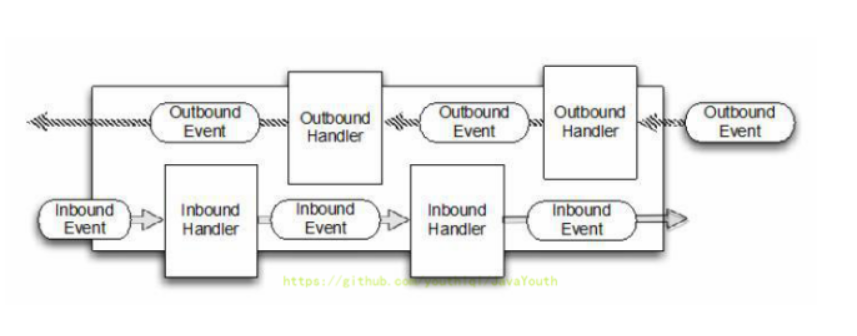

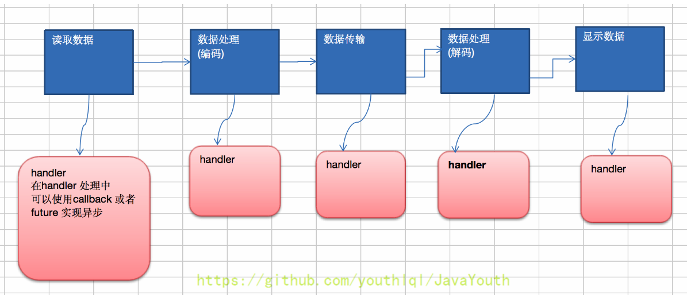

1. 在使用 `Netty` 进行编程时，拦截操作和转换出入站数据**只需要您提供 `callback` 或利用 `future` **即可。这使得链式操作简单、高效，并有利于编写可重用的、通用的代码。
2. `Netty` 框架的目标就是让你的业务逻辑从网络基础应用编码中分离出来、解脱出来。

#### 7.5.4 Future-Listener 机制

1. 当 Future 对象刚刚创建时，处于非完成状态，调用者可以通过返回的 ChannelFuture 来获取操作执行的状态，注册监听函数来执行完成后的操作。
2. 常见有如下操作
   - 通过 **isDone** 方法来判断当前操作是否完成；
   - 通过 **isSuccess** 方法来判断已完成的当前操作是否成功；
   - 通过 **getCause** 方法来获取已完成的当前操作失败的原因；
   - 通过 **isCancelled** 方法来判断已完成的当前操作是否被取消；
   - 通过 **addListener** 方法来注册监听器，当操作已完成（isDone方法返回完成），将会通知指定的监听器；如果 Future 对象已完成，则通知指定的监听器

```java
//绑定一个端口并且同步,生成了一个ChannelFuture对象
//启动服务器(并绑定端口)
ChannelFuture cf = bootstrap.bind(6668).sync();
//给cf注册监听器，监控我们关心的事件
cf.addListener(new ChannelFutureListener() {
   @Override
   public void operationComplete (ChannelFuture future) throws Exception {
      if (cf.isSuccess()) {
         System.out.println("监听端口6668成功");
      } else {
         System.out.println("监听端口6668失败");
      }
   }
});
```

#### 7.5.4 实例 - http服务

```java
package com.codeman.netty.netty.httpserver;

import io.netty.bootstrap.ServerBootstrap;
import io.netty.channel.ChannelFuture;
import io.netty.channel.EventLoopGroup;
import io.netty.channel.epoll.EpollEventLoopGroup;
import io.netty.channel.nio.NioEventLoopGroup;
import io.netty.channel.socket.nio.NioServerSocketChannel;

import java.net.InetSocketAddress;

/**
 * @author: zhanghongjie
 * @description:
 * @date: 2022/7/11 22:38
 * @version: 1.0
 */
public class HttpServer {

    public static void main(String[] args) {
        EventLoopGroup bossGroup = new NioEventLoopGroup(1);
        EventLoopGroup workerGroup = new NioEventLoopGroup();

        try {
            ServerBootstrap serverBootstrap = new ServerBootstrap();
            ChannelFuture channelFuture
                    = serverBootstrap.group(bossGroup, workerGroup)
                    .channel(NioServerSocketChannel.class)
                    .childHandler(new HttpServerInitializar())
                    .bind(new InetSocketAddress("localhost", 8878));
            channelFuture.channel().closeFuture().sync();
        } catch (InterruptedException e) {
            e.printStackTrace();
        } finally {
            bossGroup.shutdownGracefully();
            workerGroup.shutdownGracefully();
        }
    }
}
```

```java
package com.codeman.netty.netty.httpserver;

import io.netty.channel.ChannelInitializer;
import io.netty.channel.ChannelPipeline;
import io.netty.channel.socket.SocketChannel;
import io.netty.handler.codec.http.HttpServerCodec;


/**
 * @author: zhanghongjie
 * @description:
 * @date: 2022/7/11 22:52
 * @version: 1.0
 */
public class HttpServerInitializar extends ChannelInitializer<SocketChannel> {

    @Override
    public void initChannel(SocketChannel ch) throws Exception {
        ChannelPipeline pipeline = ch.pipeline();

        //加入一个netty 提供的httpServerCodec codec =>[coder - decoder]
        //HttpServerCodec 说明
        //1. HttpServerCodec 是netty 提供的处理http的 编-解码器
        pipeline.addLast("HttpServerCodec", new HttpServerCodec());
        pipeline.addLast("HttpServerHandler", new HttpServerHandler());
    }
}

```

```java
package com.codeman.netty.netty.httpserver;

import io.netty.buffer.ByteBuf;
import io.netty.buffer.Unpooled;
import io.netty.channel.ChannelHandlerContext;
import io.netty.channel.SimpleChannelInboundHandler;
import io.netty.handler.codec.http.DefaultFullHttpResponse;
import io.netty.handler.codec.http.FullHttpResponse;
import io.netty.handler.codec.http.HttpHeaderNames;
import io.netty.handler.codec.http.HttpObject;
import io.netty.handler.codec.http.HttpRequest;
import io.netty.handler.codec.http.HttpResponseStatus;
import io.netty.handler.codec.http.HttpVersion;
import io.netty.util.CharsetUtil;

import java.nio.charset.Charset;

/**
 * @author: zhanghongjie
 * @description:
 * @date: 2022/7/11 22:57
 * @version: 1.0
 */
public class HttpServerHandler extends SimpleChannelInboundHandler<HttpObject> {

    @Override
    protected void channelRead0(ChannelHandlerContext ctx, HttpObject msg) throws Exception {

        if (msg instanceof HttpRequest) {
            System.out.println("客户端地址" + ctx.channel().remoteAddress());
            HttpRequest httpRequest = (HttpRequest) msg;
            System.out.println("httpRequest url: " + httpRequest.uri());

            //回复信息给浏览器 [http协议]
            ByteBuf content = Unpooled.copiedBuffer("hello, 我是服务器",  Charset.forName("GBK"));

            //构造一个http的相应，即 httpresponse
            FullHttpResponse response = new DefaultFullHttpResponse(HttpVersion.HTTP_1_1, HttpResponseStatus.OK, content);
            response.headers().set(HttpHeaderNames.CONTENT_TYPE, "text/plain");
            response.headers().set(HttpHeaderNames.CONTENT_LENGTH, content.readableBytes());

            ctx.writeAndFlush(response);
        }
    }
}

```

### 7.6 Netty 核心模块组件
