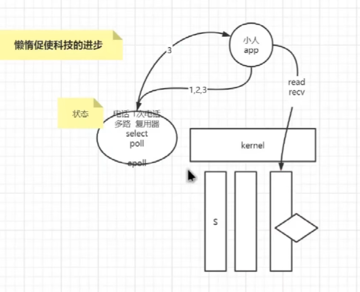

# 网络编程

## 1. TCP/IP 协议

### 1.1 *OSI七层模型* (Open System Interconnect),全称为开放系统互连参考模型

为参考模型，而TCP/IP协议为实际落地

### 1.2 分层


#### 1.2.1 应用层(应用软件:浏览器)

- 建立连接
  建立连接到传输数据时间太长会报错，一般是服务器超时，CS之间会有心跳

  ```shell
  与百度的80端口建立连接，命名为9
  [root@node1 ~]# exec 9<> /dev/tcp/www.baidu.com/80 
  ```
- 声明协议

  ```shell
  声明协议为HTTP/1.0  ， GET请求， 请求路径 "/" 标准输入流至“9”，即步骤一的连接
  [root@node1 ~]# echo -e "GET / HTTP/1.0\n" 1>& 9 
  ```
- 获取响应

  ```shell
  从“9” 获取响应，标准输入流至cat
  [root@node1 ~]# cat 0<& 9
  HTTP/1.0 200 OK
  Accept-Ranges: bytes
  Cache-Control: no-cache
  Content-Length: 9508
  Content-Type: text/html
  Date: Sun, 10 Apr 2022 08:06:07 GMT
  P3p: CP=" OTI DSP COR IVA OUR IND COM "
  P3p: CP=" OTI DSP COR IVA OUR IND COM "
  Pragma: no-cache
  Server: BWS/1.1
  Set-Cookie: BAIDUID=B3B5A1A70ED3CB8A940D63B24C2151E3:FG=1; expires=Thu, 31-Dec-3                                                                                                         7 23:55:55 GMT; max-age=2147483647; path=/; domain=.baidu.com
  Set-Cookie: BIDUPSID=B3B5A1A70ED3CB8A940D63B24C2151E3; expires=Thu, 31-Dec-37 23                                                                                                         :55:55 GMT; max-age=2147483647; path=/; domain=.baidu.com
  Set-Cookie: PSTM=1649577967; expires=Thu, 31-Dec-37 23:55:55 GMT; max-age=214748                                                                                                         3647; path=/; domain=.baidu.com
  Set-Cookie: BAIDUID=B3B5A1A70ED3CB8AC174C41E07996933:FG=1; max-age=31536000; exp                                                                                                         ires=Mon, 10-Apr-23 08:06:07 GMT; domain=.baidu.com; path=/; version=1; comment=                                                                                                         bd
  Traceid: 1649577967024981044212054023565557620158
  Vary: Accept-Encoding
  X-Frame-Options: sameorigin
  X-Ua-Compatible: IE=Edge,chrome=1

  <!DOCTYPE html><html><head><meta http-equiv="Content-Type" content="text/html; c                                                                                                         harset=UTF-8"><meta http-equiv="X-UA-Compatible" content="IE=edge,chrome=1"><met                                                                                                         a content="always" name="referrer"><meta name="description" content="全球领先的                                                                                                         中文搜索引擎、致力于让网民更便捷地获取信息，找到所求。百度超过千亿的中文网页数据                                                                                                         库，可以瞬间找到相关的搜索结果。"><

  ```

#### 1.2.2 (内核kernel)传输控制层：UDP / TCP

**TCP：面向连接的，可靠传输控制协议。**

##### (1).  三次握手和四次挥手

- 三次握手（建立TCP连接）

1. 首先Client端发送连接请求报文syn
2. Server端接收连接后回复ACK应答报文，并为这次连接分配资源。
3. Client端接收到ACK报文后也向Server段**发生ACK应答报文，并分配资源**，这样TCP连接就建立了。
   **步骤3的意义**：在完成步骤2后，只能说明S端正常，但是可能在这个时候C端断开了，所以C端需要应答S


- 四次挥手（注意第三次是S向C发送）

  1. 假设Client端发起中断连接请求，也就是发送FIN报文。
  2. Server端接到FIN报文后，意思是说"我Client端没有数据要发给你了"，但是如果你还有数据没有发送完成，则不必急着关闭Socket，可以继续发送数据。

     所以你先发送ACK，"告诉Client端，你的请求我收到了，但是我还没准备好，请继续你等我的消息"。
  3. 这个时候Client端**就进入FIN_WAIT状态**，继续等待Server端的FIN报文。
  4. 当Server端确定数据已发送完成，则向Client端发送FIN报文，"告诉Client端，好了，我这边数据发完了，准备好关闭连接了"。
  5. Client端收到FIN报文后，"就知道可以关闭连接了，但是他还是不相信网络，怕Server端不知道要关闭，所以发送ACK**后进入TIME_WAIT状态**，如果**Server端没有收到ACK则可以重传(继续发送FIN)**。“，Server端收到ACK后，"就知道可以断开连接了"。**Client端等待了2MSL后依然没有收到回复，则证明Server端已正常关闭，那好，我Client端也可以关闭连接了**。Ok，TCP连接就这样关闭了！

  

##### (2). 验证3次握手和4次挥手

- 查看网卡 ifconfig ens33
  ```shell
  [root@node1 ~]# ifconfig
  ens33: flags=4163<UP,BROADCAST,RUNNING,MULTICAST>  mtu 1500
          inet 192.168.1.181  netmask 255.255.255.0  broadcast 192.168.1.255
          inet6 fe80::ecf8:c43a:7c48:b462  prefixlen 64  scopeid 0x20<link>
          ether 00:0c:29:31:6b:1e  txqueuelen 1000  (Ethernet)
          RX packets 5874  bytes 594205 (580.2 KiB)
          RX errors 0  dropped 0  overruns 0  frame 0
          TX packets 4668  bytes 456011 (445.3 KiB)
          TX errors 0  dropped 0 overruns 0  carrier 0  collisions 0
  ```
- 抓包验证 tcpdum
  ```shell
  其他进程先请求一个80端口，比如：curl www.baidu.com
  [root@node1 ~]# tcpdump -nn -i ens33 port 80  另起一个进程监听网卡ens33的80端口
  tcpdump: verbose output suppressed, use -v or -vv for full protocol decode
  listening on ens33, link-type EN10MB (Ethernet), capture size 262144 bytes
  18:20:54.203623 IP 192.168.1.181.51788 > 36.152.44.96.80: Flags [S], seq 1125595307, win 29200, options [mss 1460,sackOK,TS val 43940445 ecr 0,nop,wscale 7], length 0  
  ↑第一次握手：C向S发送连接请求
  18:20:54.265828 IP 36.152.44.96.80 > 192.168.1.181.51788: Flags [S.], seq 923753917, ack 1125595308, win 64240, options [mss 1460], length 0
  ↑第二次握手：S向C发送ack 1125595308
  18:20:54.266223 IP 192.168.1.181.51788 > 36.152.44.96.80: Flags [.], ack 1, win 29200, length 0
  ↑第三次握手：C向S发送ack 1。建立连接成功
  18:20:54.267131 IP 192.168.1.181.51788 > 36.152.44.96.80: Flags [P.], seq 1:78, ack 1, win 29200, length 77: HTTP: GET / HTTP/1.1
  18:20:54.267939 IP 36.152.44.96.80 > 192.168.1.181.51788: Flags [.], ack 78, win 64240, length 0
  18:20:54.336191 IP 36.152.44.96.80 > 192.168.1.181.51788: Flags [P.], seq 1:2782, ack 78, win 64240, length 2781: HTTP: HTTP/1.1 200 OK
  18:20:54.336426 IP 192.168.1.181.51788 > 36.152.44.96.80: Flags [.], ack 2782, win 33580, length 0
  ↑以上做数据传输
  18:20:54.338081 IP 192.168.1.181.51788 > 36.152.44.96.80: Flags [F.], seq 78, ack 2782, win 33580, length 0
  ↑第一次挥手：C向S发送fin，询问数据传输完成情况，可否断开
  18:20:54.338942 IP 36.152.44.96.80 > 192.168.1.181.51788: Flags [.], ack 79, win 64239, length 0
  ↑第二次挥手：S向C发送ack，说等我好了会告诉你的，别急。(然后C会进入WAIT状态，超过一定时间会重复第一次挥手)
  18:20:54.405396 IP 36.152.44.96.80 > 192.168.1.181.51788: Flags [FP.], seq 2782, ack 79, win 64239, length 0
  ↑第三次挥手：S向C(注意是S向C)发送fin，告知传输完成，可以断开了
  18:20:54.405492 IP 192.168.1.181.51788 > 36.152.44.96.80: Flags [.], ack 2783, win 33580, length 0
  ↑第四次挥手：C向S发送ack。正式断开

  ```

##### (3)查看网络状态

- Socket : Local Address +  Foreign Address 组成，因此每个socket是独立的/隔离的

```shell
[root@node1 ~]# netstat -natp
Active Internet connections (servers and established)
Proto Recv-Q Send-Q Local Address           Foreign Address         State       PID/Program name
tcp        0      0 0.0.0.0:22              0.0.0.0:*               LISTEN      1159/sshd
tcp        0      0 192.168.1.181:22        192.168.1.12:4666       ESTABLISHED 101185/sshd: root@n
tcp        0      0 192.168.1.181:58226     10.10.0.1:443           ESTABLISHED 7337/calico-node
tcp        0      0 192.168.1.181:37520     10.122.166.166:8000     ESTABLISHED 4251/kube-apiserver
tcp        0      0 127.0.0.1:2379          127.0.0.1:49022         ESTABLISHED 3605/etcd
tcp        0    144 192.168.1.181:22        192.168.1.12:9748       ESTABLISHED 82707/sshd: root@pt
tcp        0      0 192.168.1.181:22        192.168.1.12:4665       ESTABLISHED 101174/sshd: root@p
tcp        0      0 127.0.0.1:49022         127.0.0.1:2379          ESTABLISHED 4251/kube-apiserver
tcp        0      0 192.168.1.181:22        192.168.1.12:9752       ESTABLISHED 82711/sshd: root@no
tcp6       0      0 :::22                   :::*                    LISTEN      1159/sshd
tcp6       0      0 192.168.1.181:6443      10.122.166.158:34780    ESTABLISHED 4251/kube-apiserver
tcp6       0      0 192.168.1.181:6443      10.122.166.166:52464    ESTABLISHED 4251/kube-apiserver
tcp6       0      0 192.168.1.181:6443      10.122.166.162:33664    ESTABLISHED 4251/kube-apiserver
tcp6       0      0 192.168.1.181:6443      10.122.166.164:36558    ESTABLISHED 4251/kube-apiserver
tcp6       0      0 192.168.1.181:6443      10.122.166.159:49678    ESTABLISHED 4251/kube-apiserver
```

#### 1.2.3 (内核kernel)网络层：寻找下一跳

```shell
[root@node1 network-scripts]# cat /etc/sysconfig/network-scripts/ifcfg-ens33
UUID=dba3fc52-6836-4579-a3de-a12b99495313
DEVICE=ens33
ONBOOT=yes
IPADDR=192.168.1.181
PREFIX=24
GATEWAY=192.168.1.2
DNS1=192.168.1.2
PEERDNS=no
```

- 寻找**下一跳**，路由表 route -n

  请求的ip与路由表中的掩码Genmask做位与运算，得到的地址和Destination对比，相同则匹配上，取Gateway作为默认网关(下一跳)

  ```shell
  [root@node1 network-scripts]# route -n
  Kernel IP routing table
  Destination     Gateway         Genmask         Flags Metric Ref    Use Iface
  0.0.0.0         192.168.1.2     0.0.0.0         UG    100    0        0 ens33
  10.122.166.128  0.0.0.0         255.255.255.192 U     0      0        0 *
  10.122.166.157  0.0.0.0         255.255.255.255 UH    0      0        0 cali4fb6f8fee1a
  10.122.166.158  0.0.0.0         255.255.255.255 UH    0      0        0 cali5728bacea63
  10.122.166.159  0.0.0.0         255.255.255.255 UH    0      0        0 cali5028c317013
  10.122.166.161  0.0.0.0         255.255.255.255 UH    0      0        0 cali258992989c9
  10.122.166.162  0.0.0.0         255.255.255.255 UH    0      0        0 cali1d5b93150cb
  10.122.166.163  0.0.0.0         255.255.255.255 UH    0      0        0 calic7277965653
  10.122.166.164  0.0.0.0         255.255.255.255 UH    0      0        0 cali41944ea6277
  10.122.166.165  0.0.0.0         255.255.255.255 UH    0      0        0 cali70272527ab0
  10.122.166.166  0.0.0.0         255.255.255.255 UH    0      0        0 cali9a4826b2f99
  172.17.0.0      0.0.0.0         255.255.0.0     U     0      0        0 docker0
  192.168.1.0     0.0.0.0         255.255.255.0   U     100    0        0 ens33
  192.168.122.0   0.0.0.0         255.255.255.0   U     0      0        0 virbr0
  ```

#### 1.2.4 (内核kernel)链路层: ARP

拿着下一跳，寻找下一跳的mac地址


```shell
// 进程1，删除arp表中的192.168.1.12，并且立即请求www.baidu.com
[root@node1 ~]# arp -d 192.168.1.12 && curl www.baidu.com

// 进程2，监听 80端口或则arp
[root@node1 ~]# tcpdump -nn -i ens33 port 80 or arp
tcpdump: verbose output suppressed, use -v or -vv for full protocol decode
listening on ens33, link-type EN10MB (Ethernet), capture size 262144 bytes
21:40:46.478136 ARP, Request who-has 192.168.1.1 tell 192.168.1.12, length 46
// 删除192.168.1.12后，找不到，因此有whoHas  tell 182
21:41:25.760375 ARP, Request who-has 192.168.1.2 tell 192.168.1.181, length 28
// 回复181，1.2的mac地址
21:41:25.760805 ARP, Reply 192.168.1.2 is-at 00:50:56:e2:9a:a0, length 46
// 三次握手
21:41:31.864949 IP 192.168.1.181.50386 > 36.152.44.96.80: Flags [S], seq 2662042806, win 29200, options [mss 1460,sackOK,TS val 264712 ecr 0,nop,wscale 7], length 0
21:41:31.868344 ARP, Request who-has 192.168.1.12 tell 192.168.1.181, length 28
21:41:31.870099 ARP, Reply 192.168.1.12 is-at 00:50:56:c0:00:08, length 46
21:41:31.935660 IP 36.152.44.96.80 > 192.168.1.181.50386: Flags [S.], seq 1990404000, ack 2662042807, win 64240, options [mss 1460], length 0
21:41:31.936255 IP 192.168.1.181.50386 > 36.152.44.96.80: Flags [.], ack 1, win 29200, length 0
21:41:31.939153 IP 192.168.1.181.50386 > 36.152.44.96.80: Flags [P.], seq 1:78, ack 1, win 29200, length 77: HTTP: GET / HTTP/1.1
21:41:31.940402 IP 36.152.44.96.80 > 192.168.1.181.50386: Flags [.], ack 78, win 64240, length 0
21:41:32.007269 IP 36.152.44.96.80 > 192.168.1.181.50386: Flags [P.], seq 1:2782, ack 78, win 64240, length 2781: HTTP: HTTP/1.1 200 OK
21:41:32.007334 IP 192.168.1.181.50386 > 36.152.44.96.80: Flags [.], ack 2782, win 33580, length 0
21:41:32.009274 IP 192.168.1.181.50386 > 36.152.44.96.80: Flags [F.], seq 78, ack 2782, win 33580, length 0
21:41:32.010876 IP 36.152.44.96.80 > 192.168.1.181.50386: Flags [.], ack 79, win 64239, length 0
21:41:32.075076 IP 36.152.44.96.80 > 192.168.1.181.50386: Flags [FP.], seq 2782, ack 79, win 64239, length 0
21:41:32.075265 IP 192.168.1.181.50386 > 36.152.44.96.80: Flags [.], ack 2783, win 33580, length 0
21:41:47.476586 ARP, Request who-has 192.168.1.1 tell 192.168.1.12, length 46


```

#### 1.2.5 物理层

前导码+数据包

## 2. CPU与IO(input/output)

### 2.1 CPU中断

中断指的是中断当前指令，而执行其他指令，根据中断向量表(k-v)去找到对应指令的callBack，然后执行。比如说播放电影一般，按到了鼠标，那么便会触发输入法程序的输入指令


### 2.2 IO的变化过程

#### 2.2.1 BIO：Block 阻塞，每个连接占有一个线程

- java demo

  ```java
  ServerSocket server = new ServerSocket(9090, 20);
  System.out.println("step1: new ServerSocket(9090, 20)");
  while (true) {
      Socket client = server.accpet(); // 阻塞1
      System.out.println("step2:client\t" + client.getPort());
      new Thread(() -> {
  	InputStream in = client.getInputStream();
  	BufferedReader read = new BufferedReader(new InputStreamReader(in));
  	while (true) {
  	    String data = read.readLine(); // 阻塞2
  	    System.out.println(data);
  	}
      }).start();
  }

  ```
- 通过strace命令监控BIO过程(跟踪进程产生的系统调用kernel[C语言])

  *strace*是跟踪进程执行时的系统调用和所接收的信号(即它跟踪到一个进程产生的系统调用,包括参数、返回值、执行消耗的时间)

  - 输出系统调用日志

    ```shell
    strace -ff -o out /usr/java/j2sdk1.4.2_19/bin/java SocketBIO
    ```
  - 
  - accept阻塞，没有接收到客户端，out日志阻塞在了accept指令
  - 接收到客户端后，accept指令继续执行
  - 开辟线程的本质：系统的clone
  - 

#### 2.2.2 NIO ： NonBlocking NBIO

- 出现的原因(**BIO的缺陷)**：
  BIO的B导致每个连接都需要占有一个线程，CPU的线程轮询除了要跑进程的逻辑，还要处理一些内核操作，这样就比较浪费CPU的资源。
  然后**BIO无法通过代码解决，这是底层内核kernel的实现，需要内核支持**

  ```shell
  man 2 socket
  ```

  
- java demo

  ```java
  List<SocketChannel> clients = new ArrayList<>();
  ServerSocketChanner ss = ServerSocketChannel.open(); // 服务端开启监听：接受客户端
  ss.bind(new InetSocketAddress(9090));
  ss.configureBlocking(false); // 重点： OS NONBLOCKING! 只让接受客户端，而不阻塞
  while (true) {
      SocketChannel client = ss.accept(); // 不会阻塞  Kernel返回-1，java返回null
      if (client == null) {
  	// 如果没有阻塞，那么这里会输出
  	// System.out.println("client==null");
      } else {
  	client.configureBlocking(false); // 
  	int port = client.socket().getPort();
  	System.out.println("client..port:" + port);
  	clients.add(client);
      }
      ByteBuffer buffer = ByteBuffer.allocateDirect(4096);// 可以在堆里 堆外
      // 遍历已经链接进来的客户端能不能读写数据
      for (SocketChannel c : clients) { // 串行化 多线程
  	int num  = c.read(buffer); // 不会阻塞, num可能>0 -1 0
  	if (num > 0) {
  	    buffer.flip();
  	    byte[] aaa = new byte[buffer.limit()];
  	    buffer.get(aaa);
  	}
      }
  }
  ```
- strace 跟踪
  
- 缺点

  **假设有10000个client连接。则系统的调用为O(n)，而有效的调用可能才1,那么就有9999次的系统调用浪费了**

#### 2.2.3 select  poll 多路复用

有一个复用器，告诉它路线，会返回有需要连接的路线



#### 2.2.4 epoll 多路复用


