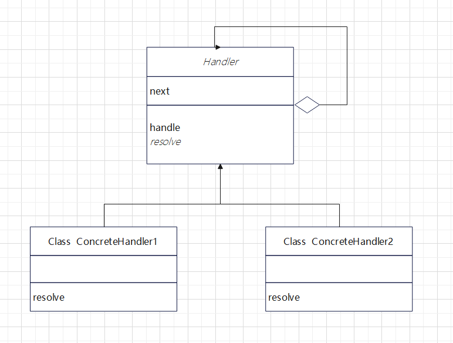
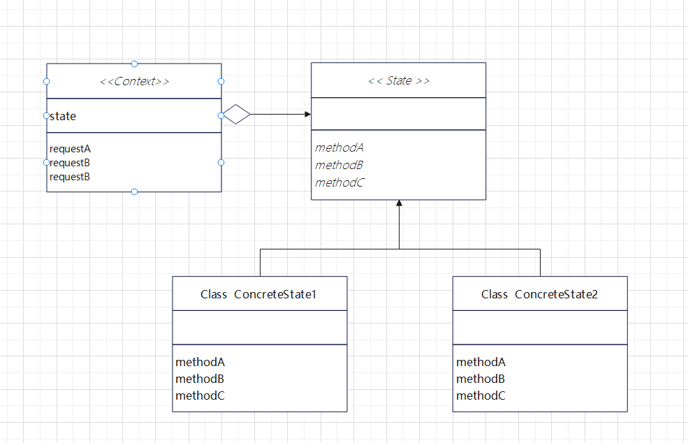
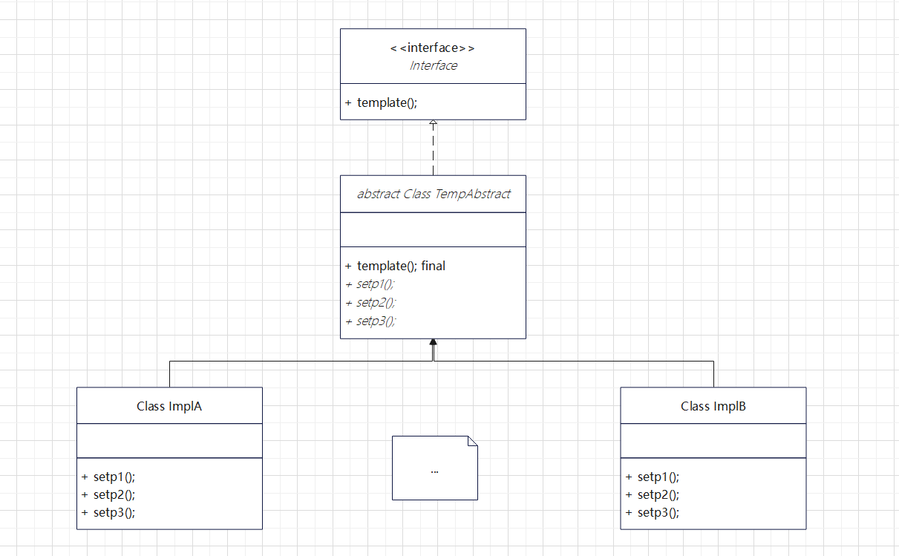
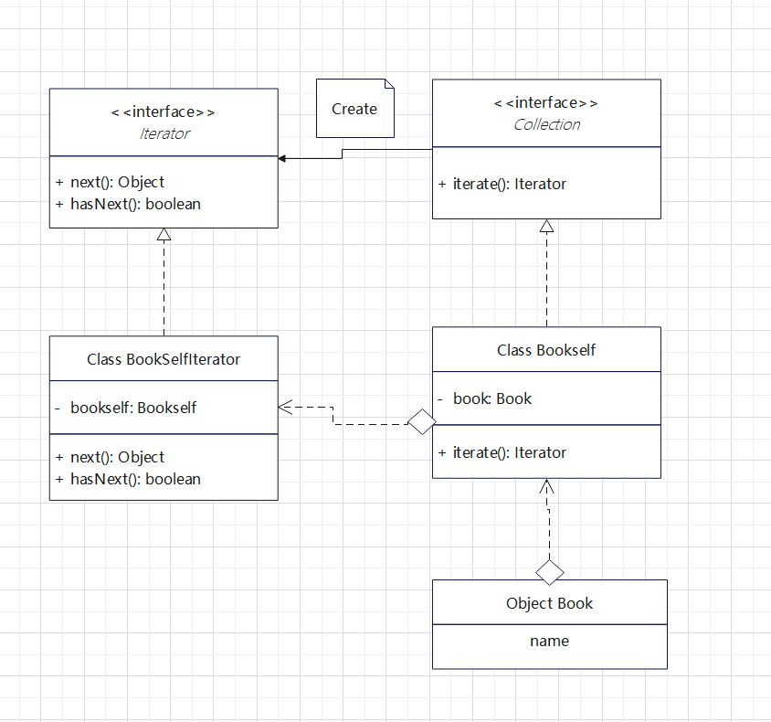
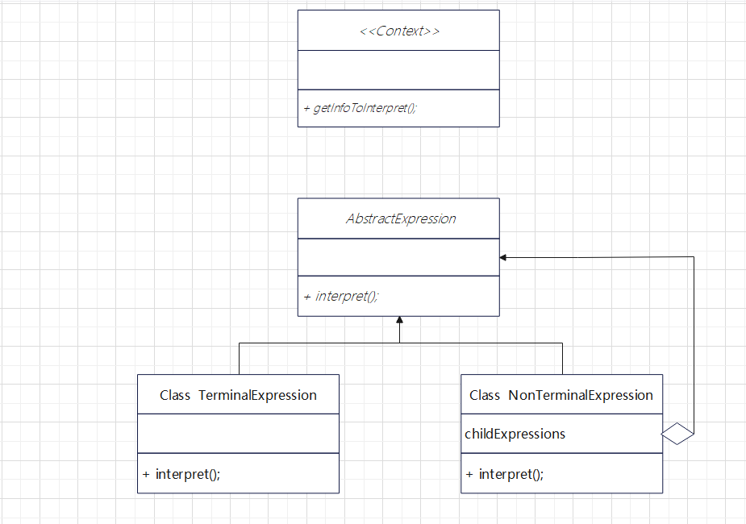
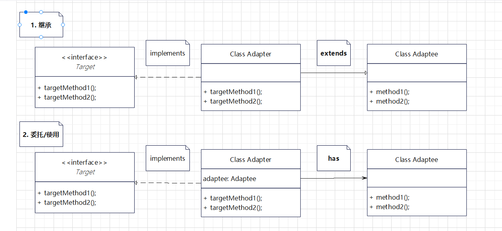

# 设计模式

## 0. 常用设计模式的使用场景：

如果需要创建实例，则通常离不开工厂和单例模式；

如果涉及较为复杂的算法流程，部分算法需要在子类实现，则会用到模板方法模式；

如果需要多种实现，并依据特定场景来选取使用，则会用到策略模式；

如果要将客户端接口及实现与框架的调用隔离，则会用到动态代理模式；

如果要灵活叠加多种功能，则会用到装饰器模式；

如果涉及到事件机制，则离不开观察者模式；

如果需要在库实现的基础上提供简洁接口，则通常用到外观模式；

如果要将多种实现与多种接口定义进行连接，则会用到桥接模式；

如果需要涉及大量配置（规格）并生成实例，则通常用到生成器模式；

如果涉及容器元素访问，则离不开迭代器模式；

如果需要以统一接口访问整体与部分的行为，且整体由部分组成，则通常用到组合模式。

理解基本设计模式的特征和适用场景，识别设计模式的使用，可以更自如地在框架源码之间穿梭。

## 1. 行为型模式

### 1.1 策略模式 Strategy

**需要多种实现，并依据特定场景来选取使用**

#### 1.1.1 应用场景

1. 比如说智能物流系统，费用单删除，费用单类型有多种，每种有各自的费用实现类，不同类型采用不同的实现类。并且使用@Resouce private Map<String, IFeeService> map; 来进行实例注入。拓展时也很方便，新增了费用类型，只需要增加新的实现类即可。
2. 比如计算器，将运算提取成接口，加减乘除四个逻辑提取出四个运算实现类，这样计算器的内部逻辑永远不会改变，算法不同时只需要新增运算实现类即可，将控制权留给运算接口调用方

#### 1.1.2 框架中使用

### 1.2 责任链模式 Chain of Responsibility

责任链就是“推卸责任”，自己解决不了就让下一个(next)尝试，直至解决问题。

#### 1.2.1 角色

- Handler 处理者
  Handler定义了具体处理的方法(final 模板)，并且知道下一个处理者是谁(next)
- ConcreteHandler 具体处理者
  实现了具体处理逻辑



#### 1.2.2 实例

```java
public class Trouble {
    private int number;

    public Trouble(int number) {
        this.number = number;
    }

    public int getNumber() {
        return number;
    }

    @Override
    public String toString() {
        return "Trouble{" +
                "number=" + number +
                '}';
    }
}


public abstract class Support {

    private String name;
    private Support next;

    public Support(String name) {
        this.name = name;
    }

    public Support setNext(Support next) {
        this.next = next;
        return next;
    }

    public final void support(Trouble trouble) {
        if (resolve(trouble)) {
            done(trouble);
        } else if (next != null) {
            next.support(trouble);
        } else {
            fail(trouble);
        }
    }

    protected abstract boolean resolve(Trouble trouble);

    protected void fail(Trouble trouble) {
        System.out.println(trouble  + "，未被解决");
    }

    protected void done(Trouble trouble) {
        System.out.println(trouble + ",被【" + this.name + "】解决！");
    }
}


public class NoSupport extends Support {

    public NoSupport(String name) {
        super(name);
    }

    @Override
    public boolean resolve(Trouble trouble) {
        return false;
    }
}

public class OddSupport extends Support {
    public OddSupport(String name) {
        super(name);
    }

    @Override
    public boolean resolve(Trouble trouble) {
        int number = trouble.getNumber();
        return number % 2 == 1;
    }
}

public class LimitSupport extends Support {

    public LimitSupport(String name) {
        super(name);
    }

    @Override
    public boolean resolve(Trouble trouble) {
        int number = trouble.getNumber();
        return number >= 8;
    }
}


public class Main {

    public static void main(String[] args) {
        Support noSupport = new NoSupport("不支持");
        Support oddSupport = new OddSupport("奇数");
        Support limitSupport = new LimitSupport("极值");

        noSupport.setNext(oddSupport)
                .setNext(limitSupport);

        IntStream.range(1, 10).mapToObj(Trouble::new).forEach(noSupport::support);
    }
}
```

### 1.3 命令模式 Command

将命令/事件当成一个类来使用，

### 1.4 中介者模式 Mediator

类似于Master-Slave，Slave之间不相互通信，而是统一和Master通信，Master就是中介/仲裁者。

### 1.5 观察者模式(订阅/发布) Observer

**涉及到事件机制，被观察者包含了所有观察者(1对多)**

### 1.6 状态模式 State

用类来表示状态，通过切换(状态)类来改变事件，这样事件全部绑定在状态类中，能干的事一清二楚，但必须了解其他状态类的功能，才能灵活切换状态。

- 分而治之
  将复杂的场景按状态细分，每个状态完成各自任务
- 使用状态模式前后对比（伪代码）

```java
// 没有使用State模式，各个事件需要很多状态的判断
class 没有使用 {

    void 使用金库() {
	if (白天)  {
	    向警报中心报告使用记录
	} else if (黑夜) {
	    向警报中心报告紧急事件
	}
    }

    void 警铃响起 () {
	向警报中心报告使用记录
    }

    void 正常通话 () {
	if (白天)  {
	    呼叫警报中心
	} else if (黑夜) {
	    呼叫警报中心的紧急电话
	}
    }
}


// 使用State模式
class 白天 {

    void 使用金库() {
	向警报中心报告使用记录
    }

    void 警铃响起 () {
	向警报中心报告使用记录
    }

    void 正常通话 () {
	呼叫警报中心
    }
}

class 黑夜 {

    void 使用金库() {
	向警报中心报告紧急事件
    }

    void 警铃响起 () {
	向警报中心报告使用记录
    }

    void 正常通话 () {
	呼叫警报中心的紧急电话
    }
}
```

#### 1.6.1 角色

- State 状态
- ConcreteState 具体的状态
- Context 上下文



#### 1.6.2 实例

```java
/** 警报中心API */
public interface Context {

    void setClock(int hour);

    void changeState(State state);

    void call(String text);

    void recordLog(String log);

    void evenListener(String even);
}


public class StateContext implements Context {

    private State state = NightState.getInstance();

    @Override
    public void setClock(int hour) {
        state.doClock(this, hour);
    }

    @Override
    public void changeState(State state) {
        this.state = state;
    }

    @Override
    public void call(String text) {
        System.out.println("【警报中心电话】：" + text);
    }

    @Override
    public void recordLog(String log) {
        System.out.println("【警报中心记录】：" + log);
    }

    @Override
    public void evenListener(String even) {
        if (even.equals("1")) {
            state.doUse(this);
        } else if (even.equals("2")) {
            state.doCall(this);
        } else if (even.equals("3")) {
            state.doAlarm(this);
        }
    }
}

/** 状态类 */
public interface State {

    void doUse(Context context);

    void doClock(Context context, int hour);

    void doCall(Context context);

    void doAlarm(Context context);
}

/** 白天 9:00 - 18:00 */
public class DayState implements State {

    private final static DayState DAY_STATE = new DayState();

    private DayState() {
    }

    public static DayState getInstance() {
        return DAY_STATE;
    }

    @Override
    public void doUse(Context context) {
        context.recordLog("白天使用了金库");
    }

    @Override
    public void doClock(Context context, int hour) {
        if (hour >= 18 || hour < 9) {
            // 切换黑夜
            context.changeState(NightState.getInstance());
        }
    }

    @Override
    public void doCall(Context context) {
        context.call("白天呼叫报警中心");
    }

    @Override
    public void doAlarm(Context context) {
        context.recordLog("白天按下了警报");
    }
}

/** 黑夜 18:00 - 9:00 */
public class NightState implements State {

    private final static NightState NIGHT_STATE = new NightState();

    private NightState() {}

    public static NightState getInstance() {
        return NIGHT_STATE;
    }

    @Override
    public void doUse(Context context) {
        context.recordLog("黑夜使用了金库，请注意");
    }

    @Override
    public void doClock(Context context, int hour) {
        if (hour < 18 && hour >= 9) {
            // 切换黑夜
            context.changeState(DayState.getInstance());
        }
    }

    @Override
    public void doCall(Context context) {
        context.call("黑夜呼叫报警中心");
    }

    @Override
    public void doAlarm(Context context) {
        context.call("黑夜拨通了紧急电话");
    }
}

public class Main {

    public static void main(String[] args) {
        Context context = new StateContext();

        context.evenListener("1");
        context.evenListener("2");
        context.evenListener("3");

        context.setClock(15);

        context.evenListener("1");
        context.evenListener("2");
        context.evenListener("3");
    }
}

```

### 1.7 摸板模式 Template



**涉及较为复杂的算法流程，父类实现了整个框架，而个性化算法需要在子类实现**

主要有三层(也可不要接口)：

    顶层为接口，定义了主要方法

   中间层为抽象类，定义了一些规范（执行步骤**，如果不想让子类重写，方法可以定义为final**），比如HttpServlet的类型转换+method匹配转发，但是规范中使用的方法为空实现(或者有默认实现)

  最底层为最终实现，补充中间抽象层中规范留下的空接口，不同的实现拥有不同的使用场景，但中间层的执行步骤固定

#### 1.7.2 框架中的使用

1. 经典的HttpServlet

```java
// 接口定义规范(方法)
public interface Servlet {
	public void init(ServletConfig config) throws ServletException;
	public ServletConfig getServletConfig();
	// 主要逻辑方法
	public void service(ServletRequest req, ServletResponse res) throws ServletException, IOException;
	public String getServletInfo();
	public void destroy();
}

// 抽象类实现接口，并重写一些默认方法
public abstract class GenericServlet implements Servlet, ServletConfig, java.io.Serializable {
	private transient ServletConfig config;

	@Override
    public ServletConfig getServletConfig() {
        return config;
    }

	@Override
    public void init(ServletConfig config) throws ServletException {
        this.config = config;
	// 这也是个摸板，抽象类中是空实现
        this.init();
    }

	public void init() throws ServletException {
        // NOOP by default
    }

// 关键逻辑留给子类实现
@Override
    public abstract void service(ServletRequest req, ServletResponse res)
            throws ServletException, IOException;

	@Override
    public String getServletName() {
        return config.getServletName();
    }

}

public abstract class HttpServlet extends GenericServlet {

	// 实现了父类的主要逻辑方法，定义了一连串必要逻辑(类型转换/请求method转发不同方法)
	@Override
    public void service(ServletRequest req, ServletResponse res)
        throws ServletException, IOException {

        HttpServletRequest  request;
        HttpServletResponse response;

        try {
            request = (HttpServletRequest) req;
            response = (HttpServletResponse) res;
        } catch (ClassCastException e) {
            throw new ServletException(lStrings.getString("http.non_http"));
        }
        service(request, response);
    }

protected void service(HttpServletRequest req, HttpServletResponse resp)
        throws ServletException, IOException {

        String method = req.getMethod();
if (method.equals(METHOD_POST)) {
	// 定义摸板，匹配转发
            doPost(req, resp);

        } else if (method.equals(METHOD_PUT)) {
            doPut(req, resp);

        }
}

// 抽象类的默认实现，子类可以重写
protected void doGet(HttpServletRequest req, HttpServletResponse resp)
        throws ServletException, IOException
    {
        String protocol = req.getProtocol();
        String msg = lStrings.getString("http.method_get_not_supported");
        if (protocol.endsWith("1.1")) {
            resp.sendError(HttpServletResponse.SC_METHOD_NOT_ALLOWED, msg);
        } else {
            resp.sendError(HttpServletResponse.SC_BAD_REQUEST, msg);
        }
    }

protected void doPost(HttpServletRequest req, HttpServletResponse resp)
        throws ServletException, IOException {

        String protocol = req.getProtocol();
        String msg = lStrings.getString("http.method_post_not_supported");
        if (protocol.endsWith("1.1")) {
            resp.sendError(HttpServletResponse.SC_METHOD_NOT_ALLOWED, msg);
        } else {
            resp.sendError(HttpServletResponse.SC_BAD_REQUEST, msg);
        }
    }
}
```

2. ReentrantLock
   ```java
   public abstract class AbstractQueuedSynchronizer extends AbstractOwnableSynchronizer {
   	// 有实现，但抛出异常，是为了编译不报错，运行报错
   	protected boolean tryAcquire(int arg) {
           	throw new UnsupportedOperationException();
       	}
   	// 摸板方式，释放锁操作
   	public final boolean release(int arg) {
   		// tryRelease父类空实现，并且抛出异常，因此子类需要实现
           	if (tryRelease(arg)) {
               		Node h = head;
               	if (h != null && h.waitStatus != 0)
                   	unparkSuccessor(h);
               	return true;
           	}
           	return false;
       	}
   	// 摸板方式尝试获取
   	public final void acquire(int arg) {
   		// tryRelease父类空实现，并且抛出异常，因此子类需要实现
           	if (!tryAcquire(arg) && acquireQueued(addWaiter(Node.EXCLUSIVE), arg))
               		selfInterrupt();
       	}
   }

   public class ReentrantLock {
   	private Sync sync;
   	abstract static class Sync extends AbstractQueuedSynchronizer {
   		// 子类实现 
   		abstract void lock();
   		// 中间层做了摸板的具体实现
           	protected final boolean tryRelease(int releases) {
               		int c = getState() - releases;
               		if (Thread.currentThread() != getExclusiveOwnerThread())
                   		throw new IllegalMonitorStateException();
               		boolean free = false;
               		if (c == 0) {
                   		free = true;
                   		setExclusiveOwnerThread(null);
               		}
               		setState(c);
              	 	return free;
           	}
   	}
   	static final class FairSync extends Sync {
               private static final long serialVersionUID = -3000897897090466540L;

               final void lock() {
                   acquire(1);
               }
   	    // 子类实现
               protected final boolean tryAcquire(int acquires) {
                   final Thread current = Thread.currentThread();
                   int c = getState();
                   if (c == 0) {
                       if (!hasQueuedPredecessors() &&
                               compareAndSetState(0, acquires)) {
                           setExclusiveOwnerThread(current);
                           return true;
                       }
                   }
                   else if (current == getExclusiveOwnerThread()) {
                       int nextc = c + acquires;
                       if (nextc < 0)
                           throw new Error("Maximum lock count exceeded");
                       setState(nextc);
                       return true;
                   }
                   return false;
               }
           }

           static final class NonfairSync extends Sync {

               final void lock() {
                   if (compareAndSetState(0, 1))
                       setExclusiveOwnerThread(Thread.currentThread());
                   else
                       acquire(1);
               }

               protected final boolean tryAcquire(int acquires) {
                   return nonfairTryAcquire(acquires);
               }
           }

   	public void lock() {
           	sync.lock();
       	}
   }
   ```

### 1.8 备忘录模式 Memento

先将某个时间点的实例的状态保存下来，之后在需要时，将实例恢复到当时的状态。

#### 1.8.1 角色

- Originator 生成者
  在保存自己最新状态时生成Memento，在需要时可以还原
- Memento 纪念品
  记录了Originator的关键信息，以便需要时还原，当然写权限不可公开给外部（**通过访问修饰符控制**），否则快照可能被修改污染。
- Caretaker 负责人
  控制着Originator的快照生成和回滚，和Originator职责分担

当快照数据量很大时，可以仅记录变更的信息，以及数据压缩(java.util.zip)来减少开支。

#### 1.8.2 实例

```java
public class Memento {

    /** 金币，默认修饰符，包内可用 */
    int money;

    /** 水果，默认修饰符，包内可用 */
    final List<String> fruits;

    /** 构造方法，包内可用 */
    Memento(int money) {
        this.money = money;
        fruits = new ArrayList<>();
    }

    /** 非重要信息，可以暴露 */
    public int getMoney() {
        return money;
    }

    List<String> getFruits() {
        return fruits;
    }

    void addFruits(String fruit) {
        fruits.add(fruit);
    }

    @Override
    public String toString() {
        return "Memento{" +
                "money=" + money +
                ", fruits=" + fruits +
                '}';
    }
}

public class Gamer {

    private int money;
    private List<String> fruits = new ArrayList<>();
    private Random random = new Random();
    private static final String[] fruitsname = {"苹果","葡萄","香蕉","橘子"};

    public Gamer() {
        this.money = 5;
    }

    public Gamer(int money) {
        this.money = money;
    }

    public void bet() {
        int dice = random.nextInt(6) + 1;
        if (dice == 1) {
            money += 100;
            System.out.println("金币增加100， 当前金币：" + money);
        } else if (dice == 2) {
            money /= 2;
            System.out.println("金币减少一半， 当前金币：" + money);
        } else if (dice == 6) {
            String fruit = fruitsname[dice % 4];
            fruits.add(fruit);
            System.out.println("增加水果:" + fruit);
        }
    }

    /** 创建快照 */
    public Memento createMemento() {
        Memento memento = new Memento(money);
        this.fruits.forEach(memento::addFruits);
        return memento;
    }

    /** 回滚快照 */
    public void restoreMemento(Memento memento) {
        this.fruits.clear();
        this.fruits = memento.getFruits();
        this.money = memento.getMoney();
    }

    public int getMoney() {
        return money;
    }

    public List<String> getFruits() {
        return fruits;
    }

    @Override
    public String toString() {
        return "Gamer{" +
                "money=" + money +
                ", fruits=" + fruits +
                '}';
    }
}


public class MementoMain {

    public static void main(String[] args) throws InterruptedException {
        // 无法创建，Memento为默认修饰符，包内可用
        // Memento memento = new Memento(5);

        Gamer gamer = new Gamer(100);
        Memento memento = gamer.createMemento();
        while (true) {
            gamer.bet();

            if (gamer.getMoney() > memento.getMoney()) {
                // 金币增加存档
                memento = gamer.createMemento();
                System.out.println("存档" + memento);
                System.out.println("存档" + gamer);
            } else if (gamer.getMoney() * 2 < memento.getMoney()) {
                // 亏本一半回档
                gamer.restoreMemento(memento);
                System.out.println("回档" + memento);
                System.out.println("回档" + gamer);
            }

            TimeUnit.SECONDS.sleep(2);
        }
    }
}
```

### 1.9 迭代器模式 Iterator



#### 1.9.1 角色

1. **Iterator 迭代器**
   定义了可迭代的接口，实现该接口即用于遍历功能，有方法next和hasNext
2. **IteratorImpl 具体迭代器**
   实现迭代器接口，并**包含了遍历集合所具备的信息(集合)**
3. **Collection 集合**
   定义可遍历的对象，拥有创建元素迭代器的功能
4. **CollectionImpl 具体集合**
   具体的集合实现类，拥有可遍历元素对象，并且可以创建该元素的迭代器对象

#### 1.9.2 实例

```java
public interface Iterator<T> {

    T next();

    boolean hasNext();
}

public interface Collection<T>{

    Iterator<T> iterate();
}

public class BookSelfIterator implements Iterator<Book> {

    private Bookself bookself;

    private int index;

    public BookSelfIterator(Bookself bookself) {
        this.bookself = bookself;
    }

    @Override
    public Book next() {
        return bookself.getIndex(index++);
    }

    @Override
    public boolean hasNext() {
        int length = bookself.getLength();
        if (index < length) {
            return true;
        }
        return false;
    }
}

public class Bookself implements Collection<Book> {

    private List<Book> bookList;

    public Bookself() {
        bookList =  new ArrayList<>();
    }

    public boolean addBook(Book book) {
        return bookList.add(book);
    }

    public Book getIndex(int index) {
        // 需求变更，重写了getIndex的逻辑，对书名进行脱敏
        // 只需要更改书架的方法，这样外部通过iterator遍历无需改动
        Book book = bookList.get(index);
        book.setName(book.getName().replaceAll("三", "*"));
        return book;
    }

    public int getLength() {
        return bookList.size();
    }


    @Override
    public Iterator<Book> iterate() {
        return new BookSelfIterator(this);
    }
}

public class Book {

    private String name;

    public Book(String name) {
        this.name = name;
    }

    public String getName() {
        return name;
    }

    public void setName(String name) {
        this.name = name;
    }

    @Override
    public String toString() {
        return "Book{" +
                "name='" + name + '\'' +
                '}';
    }
}

```

#### 1.9.3 优点 / 适合场景

优点：解耦，避免直接操作集合对象手动遍历。并且当集合内部结构发生改变，只要修改集合内部的方法即可，迭代器无需改动，即使用到迭代器的方法也无需改动。比如说集合内部遍历的脱敏处理/数据结构改变等等。

适用场景： 需要遍历的场景，遍历的规则比较特殊，比如些一些脱敏，数据排除等

### 1.10 解释器模式 Interpreter

迷你语言，利用java环境执行迷你语言。执行规则由迷你语言规则定义，变更时也只需要变更迷你语言。

#### 1.10.1 角色



- **AbstractExpression** 抽象表达式
  定义语法树Api
- **TerminalExpression** 终结符表达式
  没有嵌套，表达式的最基础组成，可以独自完成指令
- **NonTerminalExpression** 非终结符表达式
  嵌套其他表达式
- **Context** 上下文： 提供语言解析必要的信息，指令啥的

#### 1.10.2 实例

```java
/**
 * @author: zhanghongjie
 * @description: 上下文，解析字符串
 * @date: 2022/9/18 10:05
 * @version: 1.0
 */
public interface Context {

    String currentToken();
    String nextToken();

    /**
     * 校验是否有关键字，并跳过关键字
     * @throws ParseException
     */
    void skipToken(String token) throws ParseException;

    /**
     * 当command为循环指令时，识别循环次数
     * @return
     * @throws ParseException
     */
    int currentNumber() throws ParseException;
}


public class DirectionContext implements Context {
    private String currentToken;
    private StringTokenizer stringTokenizer;

    public DirectionContext(String text) {
        stringTokenizer = new StringTokenizer(text);
        nextToken();
    }

    @Override
    public String currentToken() {
        return currentToken;
    }

    @Override
    public String nextToken() {
        if (stringTokenizer.hasMoreTokens()) {
            currentToken = stringTokenizer.nextToken();
        } else {
            currentToken = null;
        }
        return currentToken;
    }

    @Override
    public void skipToken(String token) throws ParseException {
        if (!currentToken.equals(token)) {
            throw new ParseException(String.format("warning: expect [%s] , but found [%s]", token, currentToken));
        }
        nextToken();
    }

    @Override
    public int currentNumber() throws ParseException {
        int num = 0;
        try {
            num = Integer.parseInt(currentToken);
        } catch (NumberFormatException e) {
            throw new ParseException("warning：", e);
        }
        return num;
    }
}


/**
 * @author: zhanghongjie
 * @description: 定义语法树节点Api
 * @date: 2022/9/18 10:09
 * @version: 1.0
 */
public abstract class Node {

    /**
     * 每个节点都可以解析上下文语法
     * @param context
     * @throws ParseException
     */
    public abstract void parse(Context context) throws ParseException;
}


/**
 * @author: zhanghongjie
 * @description: 程序入口，程序解析节点，解析上下文是否包含程序，以program开头
 * <program> ::= program <command list>
 * @date: 2022/9/18 10:16
 * @version: 1.0
 */
public class ProgramNode extends Node {
    private Node commandListNode;
    @Override
    public void parse(Context context) throws ParseException {
        context.skipToken("program");
        commandListNode = new CommandListNode();
        commandListNode.parse(context);
    }

    @Override
    public String toString() {
        return "[program " + commandListNode;
    }
}


/**
 * @author: zhanghongjie
 * @description: 解析命令段，以end结尾
 * <command list> ::= <command>* end
 * @date: 2022/9/18 10:21
 * @version: 1.0
 */
class CommandListNode extends Node {
    private List<Node> commandNodeList = new ArrayList<>();
    @Override
    public void parse(Context context) throws ParseException {
        while (true) {
            if (context.currentToken() == null) {
                // 最后一次为空，说明没有以end结尾
                throw new ParseException("missing \"end\".");
            } else if (context.currentToken().equals("end")) {
                // 除了command，最终应该以end结尾，结束循环
                context.skipToken("end");
                break;
            } else {
                Command command = new Command();
                command.parse(context);
                commandNodeList.add(command);
            }
        }
    }

    @Override
    public String toString() {
        return commandNodeList.toString() + "]";
    }
}


/**
 * @author: zhanghongjie
 * @description: 基础命令，分为两种，普通指令和循环指令
 * <command> ::= <repeat command> | <primitive command>
 * @date: 2022/9/18 10:35
 * @version: 1.0
 */
class Command extends Node{
    private Node node;
    @Override
    public void parse(Context context) throws ParseException {
        // 切换分支
        String currentToken = context.currentToken();
        // currentToken 必不为空
        if (currentToken.equals("repeat")) {
            node = new RepeatCommandNode();
        } else {
            node = new PrimitiveCommandNode();
        }
        node.parse(context);
    }

    @Override
    public String toString() {
        return node.toString();
    }
}


/**
 * @author: zhanghongjie
 * @description: 循环指令
 * <repeat command> ::= repeat <command list>
 * @date: 2022/9/18 10:50
 * @version: 1.0
 */
class RepeatCommandNode extends Node {
    private Node node;
    private int num;
    @Override
    public void parse(Context context) throws ParseException {
        context.skipToken("repeat");
        num = context.currentNumber();
        context.skipToken(num + "");
        node = new CommandListNode();
        node.parse(context);
    }

    @Override
    public String toString() {
        return "[repeat " + num + node;
    }
}


class PrimitiveCommandNode extends Node {
    private String currentToken;
    @Override
    public void parse(Context context) throws ParseException {
        currentToken = context.currentToken();
        if (!PrimitiveCommand.contains(currentToken)) {
            throw new ParseException("error command. should in \"go\",\"left\",\"right\". but found \"" + currentToken + "\"");
        }
        context.skipToken(currentToken);
    }

    @Override
    public String toString() {
        return currentToken;
    }
}


public class Main {

    public static void main(String[] args) {
        Context context = new DirectionContext("program repeat 3 go right go end go end");
        Node programNode = new ProgramNode();
        try {
            programNode.parse(context);
            System.out.println(programNode);
        } catch (ParseException e) {
            e.printStackTrace();
        }
    }
}
```

### 1.11 访问者模式 Visitor
将数据结构和处理分离开，把对数据的处理交给访问者。当对需要对数据进行新的操作时，只需增加新的访问者即可。

#### 1.11.1 角色
- Visitor 访问者
负责对**数据结构**中的**每一个具体元素**定义特殊的访问方法visit(ConcreteElement)。
- ConcreteVisitor 具体访问者
- Element 元素
表示Visitor可访问的对象，并且声明了接受访问者的方法accept(Visitor)
- ConcreteElement 具体元素
- ObjectStructure 结构对象
负责处理Element元素集合(利用多态接受访问者accept(Visitor))

#### 1.11.2 实例
```java
public interface Element {

    void accept(Visitor visitor);
}

public abstract class Entry implements Element {

    abstract String getName();
    abstract int getSize();

    public Entry add(Entry entry) {
        throw new RuntimeException("add方法不可用");
    }

    public Iterator iterator() {
        throw new RuntimeException("iterator方法不可用");
    }

    @Override
    public String toString() {
        return getName() + "(" + getSize() + ")";
    }
}

public class File extends Entry {

    private String name;
    private int size;

    public File(String name, int size) {
        this.name = name;
        this.size = size;
    }

    @Override
    String getName() {
        return name;
    }

    @Override
    int getSize() {
        return size;
    }

    @Override
    public void accept(Visitor visitor) {
        visitor.visit(this);
    }
}

public class Directory extends Entry {

    private String name;
    private List<Entry> entryList = new ArrayList<>();

    public Directory(String name) {
        this.name = name;
    }

    @Override
    public Entry add(Entry entry) {
        entryList.add(entry);
        return this;
    }

    @Override
    public Iterator<Entry> iterator() {
        return entryList.iterator();
    }

    @Override
    String getName() {
        return name;
    }

    @Override
    int getSize() {
        int size = 0;
        Iterator<Entry> iterator = this.iterator();
        while (iterator.hasNext()) {
            Entry next = iterator.next();
            size += next.getSize();
        }
        return size;
    }

    @Override
    public void accept(Visitor visitor) {
        visitor.visit(this);
    }
}

public abstract class Visitor {

    abstract void visit(File file);

    abstract void visit(Directory directory);
}


public class ListVisitor extends Visitor {

    private String currentDir = "";

    @Override
    void visit(File file) {
        System.out.println(currentDir + "/" + file);
    }

    @Override
    void visit(Directory directory) {
        String currentDirTemp = currentDir;

        // 拼接下一级目录，用全局变量，递归时可以共享
        currentDir += "/" + directory.getName();

        Iterator<Entry> iterator = directory.iterator();
        if (!iterator.hasNext()) {
            System.out.println(currentDirTemp + "/" + directory);
        }
        while (iterator.hasNext()) {
            Entry next = iterator.next();
            // 继续用当前Visitor去处理
            // 这类采用了双重分发的形式，visit(Element)和accept(Visitor)相互递归
            next.accept(this);
        }


        // 进来是什么，结束还是什么
        currentDir = currentDirTemp;
    }
}

public class VisitorMain {

    public static void main(String[] args) {
        Visitor visitor = new ListVisitor();

        Directory directory1 = new Directory("目录1");
        Directory directory11 = new Directory("目录11");
        Directory directory12 = new Directory("目录12");
        File file11 = new File("文件11", 500);
        File file12 = new File("文件12", 789);

        Directory directory111 = new Directory("目录111");
        File file111 = new File("文件111", 567);


        directory1.add(directory11);
        directory1.add(directory12);
        directory1.add(file11);
        directory1.add(file12);
        directory11.add(directory111);
        directory11.add(file111);
        directory1.accept(visitor);
    }
}
```

## 2. 创建型模式

### 2.1. 单例模式 Singleton

- 饿汉模式（不存在多线程安全问题）：

  饿就是着急，直接创建对象。

  - 方式一：直接实例化（简洁直观）

  ```java
  /**
   * 饿汉模式：饿急了，先创建对象
   */
  public class EhanSingleton {

      // static:先创建（类加载时创建）
      // final：对象不可变
      // private 私有再暴露
      private static final EhanSingleton EHAN_SINGLETON = new EhanSingleton();

      // 私有构造器，防止创建多实例
      private EhanSingleton() {

      }

      // 暴露创建方法
      public static EhanSingleton getInstance() {
          return EHAN_SINGLETON;
      }
  }
  ```

  - 方式二：枚举类（最简洁）,并且无法被反射修改实例对象

  ```java
  public enum EnumSingleton {
      INSTANCE;
      private DBConnection dbConnection = null;

      private EnumSingleton() {
          dbConnection = new DBConnection();
      }

      public DBConnection getInstance() {
          return dbConnection;
      }
  }

  // 需要维护成单例的类
  class DBConnection {}

  class Test {
      public static void main(String[] args) {
          DBConnection instance1 = EnumSingleton.INSTANCE.getInstance();
          DBConnection instance2 = EnumSingleton.INSTANCE.getInstance();
          System.out.println(instance1 == instance2);
          System.out.println(instance1);
      }
  }

  ```

  - 方式三：静态代码块饿汉式（适合复杂实例化）

  ```java
  public class StaticBlockSingleton {
      private final static StaticBlockSingleton STATIC_BLOCK_SINGLETON;
      private String port;
      static {
          // 可以在初始化前，做复杂的动作
          // 比如从配置文件获取信息
          try {
              Properties properties = new Properties();
              properties.load(StaticBlockSingleton.class.getClassLoader().getResourceAsStream("com/codeman/designmodel/singleton/datasource.properties"));
              String port1 = properties.getProperty("port");
              STATIC_BLOCK_SINGLETON = new StaticBlockSingleton(port1);
          } catch (Exception e) {
              throw  new RuntimeException("创建异常", e);
          }
      }

      private StaticBlockSingleton(String port) {
          this.port = port;
      }

      public static StaticBlockSingleton getInstance() {
          return STATIC_BLOCK_SINGLETON;
      }

      public String getPort() {
          return port;
      }
  }

  class Test1 {
      public static void main(String[] args) {
          System.out.println(StaticBlockSingleton.getInstance().getPort());
      }
  }
  ```
- 懒汉模式：

  懒就是懒得创建，到get的时候才创建。存在多线程安全问题（延迟创建）。

  - DCL+volatile(线程安全)

  ```java
  /**
   * 懒汉：需要用时再创建
   */
  public class LazySingleton {
      // 不能是final，因为是后面创建
      private static volatile LazySingleton lazySingleton = null;

      private LazySingleton() {}

      public static LazySingleton getInstance() {
          //
          if (lazySingleton == null) {

              synchronized (LazySingleton.class) {
                  // 不加锁会有安全问题
                  if (lazySingleton == null) {
                      // 双重检查DCL也有可能不安全，因为new LazySingleton()可能会发生指令重排
                      // new LazySingleton()步骤
                      // instance=new SingletonDem(); 可以分为以下步骤(伪代码)
                      // memory=allocate();//1.分配对象内存空间
                      // instance(memory);//2.初始化对象
                      // instance=memory;//3.设置instance的指向刚分配的内存地址,此时instance!=null
                      //
                      // 步骤2和步骤3不存在数据依赖关系.而且无论重排前还是重排后程序执行的结果在单线程中并没有改变,因此这种重排优化是允许的.
                      //         memory=allocate();//1.分配对象内存空间
                      // instance=memory;//3.设置instance的指向刚分配的内存地址,此时instance!=null 但对象还没有初始化完.
                      // instance(memory);//2.初始化对象
                      //
                      // 所以当一条线程访问instance不为null时,由于instance实例未必完成初始化,也就造成了线程安全问题.
                      // 解决方案，volatile lazySingleton,禁止指令重排
                      lazySingleton = new LazySingleton();
                  }
              }
          }
          return lazySingleton;
      }

  }
  ```

  - 可采用静态内部类的形式（线程安全)

    > 基于类初始化的解决方案
    >

    JVM在类的初始化阶段（即在Class被加载后，且被线程使用之前），会执行类的初始化。

    **在执行类的初始化期间，JVM会去获取一个锁.这个锁可以同步多个线程对同一个类的初始化**。

    基于这个特性，可以实现另一种线程安全的延迟初始化方案（这个方案被称之为Initialization On Demand Holder idiom)。

  ```java
  public class LazyInnerClassSingleton {

      // 静态内部类不会随外层初始化而初始化。只有在调用时才初始化
      private final static class InnerClass {
          private static final LazyInnerClassSingleton lazyInnerClassSingleton = new LazyInnerClassSingleton();
      }

      private LazyInnerClassSingleton() {}

      public static LazyInnerClassSingleton getInstance() {
          return InnerClass.lazyInnerClassSingleton;
      }
  }
  ```

### 2.2 工厂模式 Factory Method

**对象的创建交由工厂对象创建，也不是调用者创建(负责实例的生成，常与单例配合使用)**

### 2.3 抽象工厂模式 Abstract Factory
直接由抽象工厂生成抽象零件，而不关心具体工厂和具体实现。

### 2.4 建造者模式 Builder

用来创建复杂对象用的。一般先拿到对象的builder对象，然后组装需要的参数，后builder.build()用这些复杂参数组装出对象。有点像摸板，build()做最后组装。常使用链式编程，即return this;

### 2.5 原型(模型)模式 Prototype

通过实例来生产实例 clone()

## 3. 结构型模式

### 3.1 适配器模式 Adapter

**Callable的设计**

https://dandelioncloud.cn/article/details/1438309176060760065/



#### 3.2.1 角色

1. Taraget 目标
   定义了最终想要的效果，就是需求接口
2. Adaptee 被适配
   已有的功能，被适配者和目标功能需要类似，才可以进行转换适配
3. Adaper 适配器
   **利用被适配者达到目标需求的效果**，利用有两种方式，**继承和直接使用**

#### 3.2.2 优点 / 适用场景

优点：还是解耦，通过中间适配器进行转换，而不是去修改原有的代码

适用场景：

1. 版本兼容： 不是所有的项目都是从头开始，后期迭代/需求变更/产品升级等，一些旧版本功能需要保留，但又需要拓展功能，那就可以引入适配器，调用旧方法来实现新需求，而不是直接修改旧方法。
   **而且功能测试时，也无需测试旧功能，因为旧功能旧没去改动。**
2. 

### 3.2 装饰模式 Decorator

**灵活叠加多种功能。(但是功能太散了会增加非常多的很小的类)**

**装饰器和被装饰者实现同一接口，才能在装饰后返回装饰了的被装饰者**

#### 3.2.1 案例源码

```java
// 原始接口
public interface Person {
    int cost();
    void show();
}

// 被装饰者
public class Xiaoming implements Person {

    @Override
    public int cost() {
        return 0;
    }

    @Override
    public void show() {
        System.out.println("消费前的小明");
    }
}

// 装饰器，和被装饰者实现统一接口(才能在装饰后返回装饰了的被装饰者)
public abstract class PersonShoppingDecorator implements Person {

    protected Person person;

    public PersonShoppingDecorator(Person person) {
        this.person = person;
    }
}

// 买帽子装饰器
public class PersonBuyCapDecorator extends PersonShoppingDecorator {

    public PersonBuyCapDecorator(Person person) {
        super(person);
    }

    @Override
    public int cost() {
        // 帽子50元
        return this.person.cost() + 50;
    }

    @Override
    public void show() {
        // 后装饰的将之前装饰的也包含在内
        this.person.show();
        System.out.println("买了帽子，累计花费了[" + this.cost() + "]");
    }
}


// 买鞋子装饰类
public class PersonBuyShoeDecorator extends PersonShoppingDecorator {

    public PersonBuyShoeDecorator(Person person) {
        super(person);
    }

    @Override
    public int cost() {
        // 鞋子100元
        return this.person.cost() + 100;
    }

    @Override
    public void show() {
        // 后装饰的将之前装饰的也包含在内
        this.person.show();
        System.out.println("买了鞋子，累计花费了[" + this.cost() + "]");
    }
}

// 测试类
public class Test {

    public static void main(String[] args) {
        // 原始小明
        Person xiaoming = new Xiaoming();
        // 装饰了帽子，并且返回了装饰了帽子的小明
        xiaoming = new PersonBuyCapDecorator(xiaoming);
        // 装饰了鞋子，并且返回了装饰了帽子和鞋子的小明
        xiaoming = new PersonBuyShoeDecorator(xiaoming);
        // ... 拓展时，只需在帽子/鞋子的基础上继续装饰即可
        // 最终小明
        xiaoming.show();
    }
}
```

### 3.3 享元模式 Flyweight[轻量]

主要用于减少创建对象的数量（实例共享），以减少内存占用和提高性能

需要考虑到实例哪些属性是共享的，哪些属性是外提的个性化属性。如，文本内容是共享的，字体颜色/大小是个性化

- **Intrinsic和Extrinsic**
  - Intrinsic为应当共享的
  - Extrinsci为不该共享的个性化

### 3.4 代理模式 Proxy

#### 3.4.1 Netty手写RPC，client动态代理service
```java
public class RPCNettyClient {

    private static ExecutorService executorService = Executors.newFixedThreadPool(6);
    private static RPCClientChannleHandler clientHandler = null;
    private static int count = 0;


    public static void main(String[] args) {

        //客户端需要一个事件循环组
        EventLoopGroup workGroup = new NioEventLoopGroup();

        try {
            //创建客户端启动对象
            //注意客户端使用的不是 ServerBootstrap 而是 Bootstrap
            clientHandler = new RPCClientChannleHandler();
            Bootstrap bootstrap = new Bootstrap();
            bootstrap.group(workGroup)
                    .channel(NioSocketChannel.class) // 设置客户端通道的实现类(反射)，和服务端不一样
                    .handler(new ChannelInitializer() {
                        @Override
                        protected void initChannel(Channel ch) throws Exception {
                            ch.pipeline().addLast(new StringDecoder());
                            ch.pipeline().addLast(new StringEncoder());
                            ch.pipeline().addLast(clientHandler); //加入自己的处理器
                        }
                    });

            System.out.println("客户端ok");
            //启动客户端去连接服务器端
            IService service = (IService) getBean(IService.class, APIContants.FUCTION_HELLO);
            bootstrap.connect(new InetSocketAddress("localhost", 6677)).sync();
            System.out.println("又阻塞吗");
            System.out.println(service.hello("你好鸭"));


        } catch (InterruptedException e) {
            e.printStackTrace();
        } finally {
            workGroup.shutdownGracefully();
        }

        /*clientHandler = new RPCClientChannleHandler();
        //创建EventLoopGroup
        NioEventLoopGroup group = new NioEventLoopGroup();
        Bootstrap bootstrap = new Bootstrap();
        bootstrap.group(group)
                .channel(NioSocketChannel.class)
                .option(ChannelOption.TCP_NODELAY, true)
                .handler(
                        new ChannelInitializer<SocketChannel>() {
                            @Override
                            protected void initChannel(SocketChannel ch) throws Exception {
                                ChannelPipeline pipeline = ch.pipeline();
                                pipeline.addLast(new StringDecoder());
                                pipeline.addLast(new StringEncoder());
                                pipeline.addLast(clientHandler);
                            }
                        }
                );

        try {
            IService service = (IService) getBean(IService.class, APIContants.FUCTION_HELLO);
            bootstrap.connect("127.0.0.1", 6677).sync();
            System.out.println("又阻塞吗");
            System.out.println(service.hello("你好鸭"));
        } catch (Exception e) {
            e.printStackTrace();
        }*/


    }

    public static Object getBean(final Class<?> serivceClass, final String providerName) {

        return Proxy.newProxyInstance(Thread.currentThread().getContextClassLoader(),
                new Class<?>[]{serivceClass}, (proxy, method, args) -> {

                    System.out.println("(proxy, method, args) 进入...." + (++count) + " 次");
                    //{}  部分的代码，客户端每调用一次 hello, 就会进入到该代码

                    //设置要发给服务器端的信息
                    //providerName：协议头，args[0]：就是客户端要发送给服务端的数据

                    //
                    clientHandler.setMsg(providerName + args[0]);
                    return executorService.submit(clientHandler).get();
                });
    }
}

public class RPCClientChannleHandler extends ChannelInboundHandlerAdapter implements Callable {

    private ChannelHandlerContext context;
    private String msg;
    private Object result;

    @Override
    public void channelActive(ChannelHandlerContext ctx) throws Exception {
        System.out.println("channelActive");
        context = ctx;
    }

    @Override
    public synchronized  void channelRead(ChannelHandlerContext ctx, Object msg) throws Exception {
        System.out.println("log = 客户端接收到请求：" + msg);
        result = msg;
        notify();
    }


    @Override
    public synchronized Object call() throws Exception {
        System.out.println("进来call");
        context.writeAndFlush(msg);
        wait();
        return result;
    }

    public void setMsg(String msg) {
        System.out.println("client 入参 " + msg);
        this.msg = msg;
    }
}
```

### 3.5 外观模式 Facade

### 3.6 组合模式 Composite
使容器和内容具有一致性(共同父类)，容器即可包含容器也可包含内容（有点类似Visitor的ObjectStructure结构对象）
比如，文件夹是容器，文件为内容，文件夹内部可以包含文件夹，也可包含文件，因此抽取出一个共同父类，并且在容器(文件夹)内部进行集合管理

### 3.7 桥接模式 Bridge
